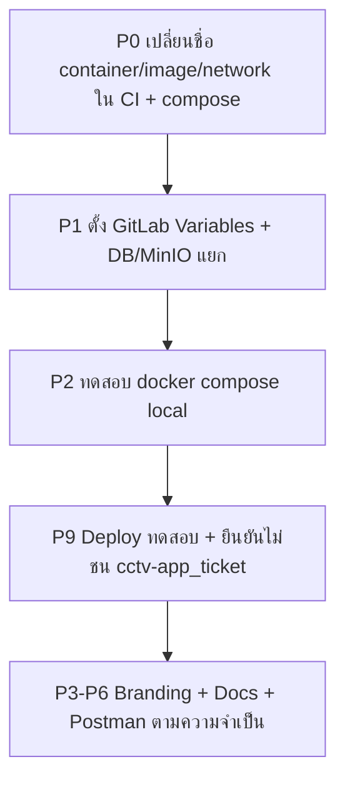

# Checklist: ย้ายโปรเจกต์จาก `cctv-app_ticket` → `dtrs-app`

> **บริบท:** โปรเจกต์นี้ clone มาจาก `http://gitlab.forthcorp.local/newbie/cctv-app_ticket.git`  
> **Remote ปัจจุบัน:** `http://gitlab.forthcorp.local/FORTH/dtrs-app.git` ✅  
> **ข้อจำกัด:** **ห้าม** push / deploy / แก้ไข repo หรือ infrastructure ของ `cctv-app_ticket` โดยตรง — ต้องใช้ชื่อ resource แยกทั้งหมด

> **Production domain:** **`https://dtrs-app.forth.co.th`** ✅ (API ที่ `/api`)

**วันที่ตรวจ:** 2026-08-05 (UAT Variables + SSH/path `.115`)  
**วิธี regenerate:** ค้นหาใน repo ด้วย pattern `cctv-app-ticket`, `cctv-app.forth`, `CCTVMaintenance`, `newbie/cctv`  
**แผน CI (UAT+PRD):** [`GitLab-CI-Plan.md`](./GitLab-CI-Plan.md) — ✅ implement ใน [`.gitlab-ci.yml`](../.gitlab-ci.yml) (+ validate env / `DOCKER_HOST` PRD transfer 2026-08-05)

---

## ความคืบหน้าล่าสุด (2026-08-05)

| ขั้น | สถานะ | หมายเหตุ |
|------|--------|----------|
| P0 โค้ด (Docker/CI/compose) | ✅ | ชื่อ container/image/network + พอร์ต 8404/8405 |
| P2 local `.env` | ✅ (dev) | `backend/.env` → DB `dtrs_app`; `frontend/.env` + `.env.local` sync |
| **MinIO bucket `dtrs-app`** | ⏸️ **รอทีม infra** | ตั้งชื่อใน `.env` / `.env.example` แล้ว — **ยังไม่สร้าง bucket บน MinIO server** |
| P2 `API_INTERNAL_BASE_URL` (local) | ✅ | `http://localhost:4100/api` เมื่อ `npm run dev` + backend บนเครื่องเดียวกัน |
| P9 ทดสอบ local (npm) | 🟡 บางส่วน | `prisma generate`, backend `:4100`, frontend `:3000` ผ่าน — ยังไม่ยืนยัน login E2E / อัปโหลดรูป |
| **แผน GitLab CI (UAT+PRD)** | ✅ implement | [`.gitlab-ci.yml`](../.gitlab-ci.yml) + [`GitLab-CI-Plan.md`](./GitLab-CI-Plan.md) · hardening validate env + PRD `docker load` |
| P1 GitLab Variables **UAT** (`staging`) | ✅ กลุ่ม A | 8 ตัวบน GitLab UI — ดู [`GitLab-CI-Variables-Checklist.md`](./GitLab-CI-Variables-Checklist.md) |
| P1 GitLab Variables **PRD** (`production`) | ☐ | ยังไม่ตั้ง |
| SSH + path UAT `.115` | ✅ | `authorized_keys` append key `dtrs-app-uat` · `/home/nurdin/dtrs-app` · SSH จากเครื่อง dev ผ่าน |
| P0 #11 NPM | ☐ | `dtrs-app.forth.co.th` → 8404/8405 |
| P9 Docker compose / CI deploy | ☐ | ยังไม่ push `staging` / ยังไม่กด deploy · CI มี health check หลัง `docker run` แล้ว (2026-08-06) |

**ขั้นถัดไปที่แนะนำ:** ยืนยัน GitLab `SSH_PRIVATE_KEY` (staging) เป็น private คู่ `dtrs-app-uat` → **`npx prisma migrate deploy` กับ DB UAT** → commit **เฉพาะ** CI/Docker/docs (แยกจาก UI diff อื่น) + push **`staging`** → ตรวจ `DOCKER_HOST=tcp://127.0.0.1:2375 docker ps` บน `.115` → pipeline + manual **`deploy:uat:docker`** (ต้องผ่าน health check) → Variables PRD + MinIO / NPM ภายหลัง

---

## สรุปความเสี่ยงหลัก

| ความเสี่ยง | สาเหตุ | ผลกระทบ |
|-----------|--------|---------|
| **ชน container / port กับ PRD เดิม** | ~~8309/8310~~ → **8404/8405** แยกจาก `cctv-app_ticket` (8309/8310) | ✅ แยก host port แล้ว |
| **ชน MinIO bucket** | bucket ใหม่ยังไม่ถูกสร้างบน MinIO — default ในโค้ด/docs ยังชี้ `cctv-app` / `cctv-report-images` | ⏸️ **รอทีม infra สร้าง bucket** (ชื่อที่ตกลง: `dtrs-app`) ก่อนทดสอบอัปโหลด/deploy |
| **ชน database** | local `backend/.env` ชี้ `dtrs_app` แล้ว | ⚠️ ยืนยัน GitLab `DATABASE_URL` ก่อน deploy |
| **CI deploy path เดิม** | ~~`/home/newbie/cctv-app-ticket`~~ → `/home/nurdin/dtrs-app` (PRD `.128`) | ✅ แก้แล้วใน `.gitlab-ci.yml` |
| **Branding ยังเป็น CCTV ทั้งระบบ** | UI, อีเมล, PDF, metadata | ผู้ใช้เห็นชื่อเก่า (อาจตั้งใจถ้ายังเป็นระบบ CCTV) |

---

## ✅ ทำแล้ว

- [x] เปลี่ยน `git remote origin` → `http://gitlab.forthcorp.local/FORTH/dtrs-app.git`
- [x] README อ้าง database ชื่อ `dtrs_app`; **local** `backend/.env` ชี้ `dtrs_app` แล้ว
- [x] **Production domain** → `https://dtrs-app.forth.co.th` (README, AGENTS, Postman, settings placeholder, NPM doc)
- [x] **Docker/CI ชื่อแยกจาก `cctv-app_ticket`** — `dtrs-app-backend` / `dtrs-app-frontend` / `dtrs-app-net` (`.gitlab-ci.yml`, `docker-compose.yml`)
- [x] **Deploy path PRD** → `/home/nurdin/dtrs-app` บน `nurdin@192.168.0.128` · **UAT** → `/home/nurdin/dtrs-app` บน `.115`
- [x] **CI ไม่ `docker rm` container ของ `cctv-app_ticket`** แล้ว (ลบเฉพาะ `dtrs-app-*`)
- [x] **Host ports แยกจาก cctv-app_ticket** — frontend **8404→3000**, backend **8405→4100** (cctv ใช้ 8309/8310 → **4000** ภายใน)
- [x] **เทมเพลต env** — `backend/.env.example`, `frontend/.env.example` (track git); `frontend/.gitignore` อนุญาต `!.env.example`
- [x] **Local frontend env** — `frontend/.env` และ `.env.local` sync; `NEXT_PUBLIC_API_BASE_URL=http://localhost:4100/api`
- [x] **Local `API_INTERNAL_BASE_URL`** — `http://localhost:4100/api` (server-side Next → Nest บนเครื่อง dev)
- [x] **Local backend env (ชื่อ bucket ใน config)** — `PORT=4100`, `MINIO_BUCKET_NAME=dtrs-app` (ใน `.env` — **bucket บน MinIO server ยังรอทีมสร้าง**), `ALLOWED_ORIGINS` รวม localhost + PRD domain
- [x] **ทดสอบ npm dev (2026-08-05)** — `npx prisma generate`, `npm run start:dev` → `GET /api` **200**; `npm run dev` → `/login` **200**
- [x] **GitLab Variables UAT (2026-08-05)** — กลุ่ม A scope `staging` ครบ 8 ตัว (`SSH_PRIVATE_KEY`, `DATABASE_URL`, `JWT_SECRET`, `NEXTAUTH_SECRET`, `NEXTAUTH_URL`, `NEXT_PUBLIC_API_BASE_URL`, `FRONTEND_BASE_URL`, `ALLOWED_ORIGINS`) — secret ใหม่ ไม่ reuse `cctv-app_ticket` / PRD
- [x] **SSH UAT `.115` (2026-08-05)** — gen key `dtrs-app-uat` · **append** public ลง `~/.ssh/authorized_keys` ของ `nurdin` (ไม่ลบ key โปรเจกต์อื่น) · path `/home/nurdin/dtrs-app` · `ssh -i … nurdin@192.168.0.115` → `whoami` + `ls -ld` ผ่าน

---

## P0 — ต้องทำก่อน deploy ครั้งแรก (ชนกับ `cctv-app_ticket`)

> ถ้า PRD เดิม (`cctv-app_ticket`) ยังรันบนเครื่องเดียวกัน ต้อง **แยกทุกอย่าง** ไม่ reuse ชื่อเดิม

### Docker / CI — ชื่อ image, container, network

| # | รายการ | ค่าปัจจุบัน (เก่า) | แนะนำ (dtrs-app) | ไฟล์ | สถานะ |
|---|--------|-------------------|------------------|------|--------|
| 1 | Image backend | ~~`cctv-app-ticket-backend`~~ | `dtrs-app-backend` | `.gitlab-ci.yml` | ✅ |
| 2 | Image frontend | ~~`cctv-app-ticket-frontend`~~ | `dtrs-app-frontend` | `.gitlab-ci.yml` | ✅ |
| 3 | Container backend | ~~`cctv-app-ticket-backend`~~ | `dtrs-app-backend` | `.gitlab-ci.yml`, `docker-compose.yml` | ✅ |
| 4 | Container frontend | ~~`cctv-app-ticket-frontend`~~ | `dtrs-app-frontend` | `.gitlab-ci.yml`, `docker-compose.yml` | ✅ |
| 5 | Container legacy (ลบเก่า) | ~~`cctv-app-ticket`~~ | `dtrs-app` | `.gitlab-ci.yml` | ✅ |
| 6 | Docker network | ~~`cctv-app-ticket-net`~~ | `dtrs-app-net` | `.gitlab-ci.yml` | ✅ |
| 7 | `API_INTERNAL_BASE_URL` | ~~`http://cctv-app-ticket-backend:4000/api`~~ | `http://dtrs-app-backend:4100/api` | `.gitlab-ci.yml`, `serverApiBase.ts` | ✅ |
| 8 | คอมเมนต์ตัวอย่าง internal URL | ~~`cctv-app-ticket-backend`~~ | `dtrs-app-backend` | `frontend/src/lib/serverApiBase.ts` | ✅ |

### พอร์ต host (ถ้ารันคู่กับ PRD เดิมบนเครื่องเดียวกัน)

| # | รายการ | ค่าปัจจุบัน | การตัดสินใจ | สถานะ |
|---|--------|------------|-------------|--------|
| 9 | Frontend host port | ~~`8309→3000`~~ | **`8404→3000`** | `docker-compose.yml`, `.gitlab-ci.yml` | ✅ |
| 10 | Backend host port | ~~`8310→4000`~~ | **`8405→4100`** (host→container) | `docker-compose.yml`, `.gitlab-ci.yml` | ✅ |
| 11 | อัปเดต NPM / reverse proxy | forward **8404/8405** | ตั้ง `dtrs-app.forth.co.th` → 8404 (Next) / 8405 (Nest) | NPM | ☐ |

ไฟล์ที่ sync หลังเปลี่ยนพอร์ต: `docker-compose.yml`, `.gitlab-ci.yml`, `backend/docs/Reverse-Proxy-Nginx-Proxy-Manager.md`, `README.md`, `PLAN.md` ✅ — `STATUS.md`, `TASK.md`, checklist นี้ ✅ (2026-08-05)

### Deploy path / SSH

| # | รายการ | ค่าปัจจุบัน | แนะนำ | ไฟล์ | สถานะ |
|---|--------|------------|-------|------|--------|
| 12 | Deploy path PRD | ~~`/home/newbie/cctv-app-ticket`~~ | `/home/nurdin/dtrs-app` บน `.128` | `.gitlab-ci.yml` | ✅ |
| 12b | Deploy path UAT | — | `/home/nurdin/dtrs-app` บน `.115` | `.gitlab-ci.yml` + สร้างบน server แล้ว | ✅ server 2026-08-05 |
| 13 | SSH user / host PRD | — | **`nurdin@192.168.0.128`** | `.gitlab-ci.yml` | ✅ |
| 13b | SSH user / host UAT | — | `nurdin@192.168.0.115` | `.gitlab-ci.yml` | ✅ SSH ทดสอบผ่าน |
| 13c | SSH key UAT | — | `SSH_PRIVATE_KEY` scope `staging` = คู่ `dtrs-app-uat` · public **append** ใน `authorized_keys` | GitLab + `.115` | ✅ UAT · ☐ PRD |
| 14 | Docker build / deploy PRD | — | build `.115` → `transfer:prd:images` (`DOCKER_HOST_PRD` + load) → deploy `.128` | `.gitlab-ci.yml` | ✅ implement |
| 14b | MySQL UAT | — | host **`192.168.0.11`**, db **`dtrs_app`** | [`GitLab-CI-Plan.md`](./GitLab-CI-Plan.md) | ✅ grilling |
| 14c | MySQL PRD | — | host **`192.168.0.126`**, db **`dtrs_app`** | GitLab Variables | ✅ grilling |

---

## P1 — GitLab Project Settings (ทำบน GitLab UI)

| # | รายการ | หมายเหตุ | สถานะ |
|---|--------|---------|--------|
| 15 | สร้าง/ยืนยัน project `FORTH/dtrs-app` | แยกจาก `newbie/cctv-app_ticket` | ✅ ตั้ง Variables บน UI แล้ว |
| 16 | ตั้ง GitLab CI/CD Variables | **UAT (`staging`) กลุ่ม A ✅** · **PRD (`production`) ☐** — [`GitLab-CI-Variables-Checklist.md`](./GitLab-CI-Variables-Checklist.md) | 🟡 UAT แล้ว |
| 17 | Environment URL | PRD: `https://dtrs-app.forth.co.th` · UAT: `http://192.168.0.115:8404` | ✅ grilling |
| 18 | Protected branches / runners | runner tag **`docker` + `forth`** (ตามแผน CI) | ☐ |
| 19 | Manual deploy + ไม่ชน container เก่า | deploy **manual** · `docker rm` เฉพาะ `dtrs-app-*` · validate กลุ่ม A ก่อน deploy | `.gitlab-ci.yml` | ✅ implement |
| 20 | Branch UAT | **`staging`** → pipeline UAT — ดู [`GitLab-CI-Plan.md`](./GitLab-CI-Plan.md) | ✅ grilling |

---

## P2 — Environment / `.env` (local + PRD)

> ไฟล์ `.env` ไม่ขึ้น git — ตรวจในเครื่อง dev และ GitLab Variables

### ⏸️ MinIO bucket — รอทีม infra (block ก่อนทดสอบอัปโหลด / deploy PRD)

| รายการ | สถานะ | หมายเหตุ |
|--------|--------|----------|
| ตกลงชื่อ bucket PRD | ✅ | **`dtrs-app`** (แยกจาก `cctv-app`) |
| ตกลงชื่อ bucket UAT | ✅ | **`dtrs-app-uat`** — [`GitLab-CI-Plan.md`](./GitLab-CI-Plan.md) |
| สร้าง bucket บน MinIO server | ⏸️ **รอทีม infra** | PRD + UAT — ห้ามทดสอบอัปโหลดจน bucket มีจริง |
| Policy / access key แยก | ⏸️ รอ | ดู P8 ข้อ 68 — หลัง bucket พร้อม |
| ตั้ง `MINIO_BUCKET_NAME` ใน GitLab Variables | ☐ | ทำพร้อม deploy หลัง bucket สร้างแล้ว |

**ระหว่างรอ:** dev อื่น (login, API, หน้า UI) ทำได้ — **อย่า** อัปโหลดรูปงาน/avatar จน bucket พร้อม (หรือ `MINIO_AUTO_CREATE_BUCKET=true` ถ้า policy อนุญาตและทีมยืนยัน)

| # | ตัวแปร | จุดที่ต้องตรวจ | ค่าแนะนำ / หมายเหตุ | สถานะ |
|---|--------|---------------|---------------------|--------|
| 20 | `DATABASE_URL` | `backend/.env`, GitLab | **local:** ตาม `.env` · **UAT GitLab ✅** `@192.168.0.11/dtrs_app` · **PRD:** `@192.168.0.126/dtrs_app` ☐ | ✅ UAT · ☐ PRD |
| 21 | `MINIO_BUCKET_NAME` | `backend/.env`, GitLab | **UAT:** `dtrs-app-uat` · **PRD:** `dtrs-app` — **อย่า** ใช้ `cctv-app` | ⏸️ รอ bucket · ☐ GitLab |
| 22 | `MINIO_PUBLIC_URL` | `.env` / CI | URL ที่ browser/API อ้างอิง — sync กับ bucket ใหม่ | ⏸️ รอ bucket · ☐ GitLab |
| 23 | `FRONTEND_BASE_URL` | backend `.env` / CI | local + **UAT GitLab ✅** `http://192.168.0.115:8404` · **PRD:** `https://dtrs-app.forth.co.th` ☐ | ✅ UAT · ☐ PRD |
| 24 | `NEXT_PUBLIC_API_BASE_URL` | frontend build-arg / CI | local: `http://localhost:4100/api` · **UAT GitLab ✅** `http://192.168.0.115:8405/api` · **PRD:** `https://dtrs-app.forth.co.th/api` ☐ | ✅ UAT · ☐ PRD |
| 25 | `NEXTAUTH_URL` | frontend container | local: `http://localhost:3000` · **UAT GitLab ✅** `http://192.168.0.115:8404` · **PRD:** `https://dtrs-app.forth.co.th` ☐ | ✅ UAT · ☐ PRD |
| 26 | `ALLOWED_ORIGINS` | backend container | local + **UAT GitLab ✅** `http://192.168.0.115:8404` · **PRD:** `https://dtrs-app.forth.co.th` ☐ | ✅ UAT · ☐ PRD |
| 27 | `NEXT_PUBLIC_APP_NAME` | frontend `.env` | ชื่อแอปที่แสดงใน footer (ถ้า rebrand) | ✅ (`ระบบแจ้งซ่อม CCTV`) |
| 28 | `API_INTERNAL_BASE_URL` | frontend `.env.local` / container | **local dev:** `http://localhost:4100/api` · **Docker/PRD:** `http://dtrs-app-backend:4100/api` · **compose จาก host:** `http://localhost:8405/api` | ✅ local + CI default · ☐ ยืนยันบน PRD |

> **อ้างอิง:** `frontend/src/lib/serverApiBase.ts` — server-side Next (NextAuth, print-jobs) ใช้ตัวแปรนี้; เบราว์เซอร์ใช้ `NEXT_PUBLIC_API_BASE_URL`

**ความไม่สอดคล้อง default ในโค้ด (ต้องเลือกค่าเดียว):**

| ไฟล์ | Default bucket |
|------|----------------|
| `backend/src/minio/minio.service.ts` | `cctv-report-images` |
| `docs/minio.md` | `cctv-app` |
| `backend/scripts/migrate-user-avatars-to-minio.ts` | `cctv-app` |
| `backend/scripts/migrate-appsheet-images-to-minio.ts` | `cctv-report-images` |
| `backend/scripts/import-appsheet-employees.ts` | `cctv-report-images` |

→ ตั้ง `MINIO_BUCKET_NAME` ใน `.env` ให้ชัด และพิจารณาแก้ default ในโค้ด/docs ให้เป็น `dtrs-app` (หรือชื่อที่ทีมตกลง)

---

## P3 — Branding / UI / ข้อความผู้ใช้ (ตัดสินใจกับทีม)

> ถ้า `dtrs-app` ยังเป็น **ระบบแจ้งซ่อม CCTV** อยู่ อาจ **ไม่ต้อง** เปลี่ยนข้อความ UI — แต่ควรแยก **ชื่อ technical** (container, bucket, domain) ออกจาก **ชื่อธุรกิจ**

| # | รายการ | ไฟล์ | สถานะ |
|---|--------|------|--------|
| 29 | ชื่อแอป (browser tab) | `frontend/src/app/layout.tsx` — `CCTV Maintenance` | ☐ |
| 30 | คำอธิบาย meta | `frontend/src/app/layout.tsx` | ☐ |
| 31 | Header / footer default | `frontend/src/components/SiteHeader.tsx`, `frontend/src/lib/appMeta.ts` | ☐ |
| 32 | หน้า login | `frontend/src/app/login/page.tsx` | ☐ |
| 33 | Dashboard overview | `frontend/src/app/dashboard/page.tsx` | ☐ |
| 34 | Placeholder `publicBaseUrl` | `frontend/src/app/dashboard/settings/page.tsx` | ✅ `https://dtrs-app.forth.co.th` |
| 35 | อีเมล HTML header/footer | `backend/src/jobs/job-email-html.ts` | ☐ |
| 36 | อีเมล test subject | `backend/src/settings/mail.service.ts` | ☐ |
| 37 | ชื่อไฟล์ PDF แนบอีเมล | `backend/src/jobs/job-email-notification.service.ts` — `CCTV-Job-*.pdf` | ☐ |
| 38 | หัวข้อ PDF รายงาน | `backend/src/jobs/jobs-pdf.service.ts` | ☐ |
| 39 | ข้อความใน PDF template | `frontend/src/components/pdf/JobMaintenancePdfTemplate.tsx` (โครงการ CCTV 5 จังหวัด — **business copy**) | ☐ |
| 40 | Public layout watermark | `frontend/src/components/PublicLayoutShell.tsx` (icon CCTV — OK ถ้ายังเป็นระบบ CCTV) | ☐ |

---

## P4 — เอกสาร (docs / README)

| # | ไฟล์ | สิ่งที่ยังอ้างโปรเจกต์เก่า | สถานะ |
|---|------|---------------------------|--------|
| 41 | `README.md` | โดเมน + container `dtrs-app-*` | ✅ (ชื่อระบบ CCTV ยังอยู่ — business name) |
| 42 | `STATUS.md` | หัวข้อ / CI notes + migration progress | ✅ (2026-08-05) |
| 43 | `PLAN.md` | path โปรเจกต์ + container names | ✅ |
| 44 | `TASK.md` | ชื่อระบบ + CI ports + Phase migration | ✅ (2026-08-05) |
| 45 | `frontend/README.md` | ชื่อระบบ | ☐ |
| 46 | `backend/README.md` | ชื่อระบบ | ☐ |
| 47 | `docs/minio.md` | `MINIO_BUCKET_NAME="cctv-app"` | ☐ |
| 48 | `docs/Email-Notifications.md` | ชื่อระบบ | ☐ |
| 49 | `backend/docs/Reverse-Proxy-Nginx-Proxy-Manager.md` | ตัวอย่าง `dtrs-app.forth.co.th` | ✅ |
| 50 | `backend/docs/api-endpoints.json` | title `CCTV Maintenance API` | ☐ |
| 51 | `.gitlab-ci.yml` | คอมเมนต์ header `CCTV Maintenance` | ☐ |
| 52 | `AGENTS.md` / `AGENT_INSTRUCTIONS.md` | ตัวอย่าง design prompt `CCTV System` (ต่ำ) | ☐ |

---

## P5 — Postman / เครื่องมือ API

| # | ไฟล์ | สิ่งที่ต้องปรับ | สถานะ |
|---|------|---------------|--------|
| 53 | `backend/postman/CCTV-Maintenance-API.postman_collection.json` | ชื่อ collection + description | ☐ |
| 54 | `backend/postman/CCTV-Print-PDF-Debug.postman_collection.json` | `publicBaseUrl`, `apiBase` | ✅ |
| 55 | `backend/postman/PRINT-PDF-DEBUG.md` | ตัวอย่าง URL | ✅ |
| 56 | `backend/postman/README.md` | ชื่อ collection | ☐ |

*(การ rename ไฟล์ Postman เป็น `DTRS-*.postman_collection.json` เป็นทางเลือก — ต้องอัปเดตลิงก์ใน README ด้วย)*

---

## P6 — Package / metadata

| # | รายการ | ค่าปัจจุบัน | แนะนำ | สถานะ |
|---|--------|------------|-------|--------|
| 57 | `frontend/package.json` → `name` | `frontend` | `dtrs-app-frontend` (optional) | ☐ |
| 58 | `backend/package.json` → `name` | `nest-typescript-starter` | `dtrs-app-backend` | ☐ |
| 59 | `backend/package.json` → `description` | Nest starter | คำอธิบายโปรเจกต์จริง | ☐ |
| 60 | `frontend/package.json` → `version` | `2.1.1` | reset เป็น `1.0.0` ถ้า fork ใหม่ (optional) | ☐ |

---

## P7 — สคริปต์ one-off / migration (ต่ำ — ใช้เมื่อ import ข้อมูล)

> ไม่กระทบ runtime ถ้าไม่รัน script — แต่ path และ bucket default ควรรู้ไว้

| # | ไฟล์ | หมายเหตุ | สถานะ |
|---|------|---------|--------|
| 61 | `backend/scripts/seed-from-excel.ts` | อ่าน `ระบบแจ้งซ่อม CCTV .xlsx`, sheet `ระบบแจ้งซ่อม CCTV ` | ☐ |
| 62 | `backend/scripts/migrate-excel.ts` | path Excel เดิม | ☐ |
| 63 | `backend/scripts/migrate-*-to-minio.ts` | โฟลเดอร์ `CCTVMaintenance-641488446` ที่ root | ☐ |
| 64 | `backend/scripts/import-appsheet-employees.ts` | AppSheet URL `CCTVMaintenance-641488446` | ☐ |
| 65 | `backend/scripts/seed-admin.ts` | `admin@forth.co.th` — ยืนยันว่าเหมาะกับ env ใหม่ | ☐ |
| 66 | `backend/src/minio/minio.service.spec.ts` | test fixture ใช้ bucket `cctv-app` — OK เป็น mock | ☐ |

---

## P8 — Security (แนะนำเมื่อ fork)

| # | รายการ | สถานะ |
|---|--------|--------|
| 67 | Rotate `JWT_SECRET`, `NEXTAUTH_SECRET` สำหรับ `dtrs-app` | ☐ |
| 68 | MinIO access key แยก หรือ policy แยก bucket | ⏸️ รอ bucket `dtrs-app` จากทีม infra |
| 69 | SMTP credentials แยก (ถ้า production แยก) | ☐ |
| 70 | ตรวจว่าไม่มี secret ใน docs/commit (`grep` คำว่า password, secret, key) | ☐ |
| 71 | รัน `npm run security:audit:prod` ทั้ง frontend และ backend | ☐ |

---

## P9 — การตรวจหลังแก้ (Verification)

### Local

- [x] `backend/.env` ชี้ `dtrs_app` + `MINIO_BUCKET_NAME=dtrs-app` ใน config (2026-08-05)
- [x] `cd backend && npx prisma generate && npm run start:dev` — API ที่ `:4100/api` (`GET /api` → 200)
- [x] `cd frontend && npm run dev` — หน้าเว็บที่ `:3000` (`/login` → 200)
- [ ] Login E2E ด้วย user ใน `dtrs_app` (หรือรัน `seed-admin.ts` ถ้ายังไม่มี admin)
- [ ] `docker compose up --build` — container ชื่อ **`dtrs-app-*`** ไม่ใช่ `cctv-app-ticket-*`
- [ ] ⏸️ อัปโหลดรูปงาน → bucket `dtrs-app` (**รอทีม infra สร้าง bucket ก่อน**)

### CI/CD — UAT (`staging`) และ PRD (`main`)

> แผน job/stage: [`GitLab-CI-Plan.md`](./GitLab-CI-Plan.md)

**UAT (`.115`, manual deploy)**

- [x] SSH + path — `nurdin@192.168.0.115` · `/home/nurdin/dtrs-app` · key `dtrs-app-uat` (2026-08-05)
- [x] GitLab Variables กลุ่ม A scope `staging`
- [ ] **`npx prisma migrate deploy`** กับ DB UAT (`192.168.0.11` / `dtrs_app`) — **ก่อน** กด deploy ครั้งแรก (CI ไม่ migrate ให้)
- [ ] ยืนยัน `DOCKER_HOST=tcp://127.0.0.1:2375 docker ps` บน `.115`
- [ ] Commit + push branch `staging` (แยก CI/infra จาก UI diff อื่น)
- [ ] Pipeline บน branch `staging` — test (FE lint + BE eslint + jest) + build ผ่าน
- [ ] Manual deploy UAT — container `dtrs-app-*` บน port 8404/8405 และ job **ไม่ fail** health check
- [ ] Login / API ที่ `http://192.168.0.115:8404`

**PRD (`.128`, manual deploy)**

- [ ] Pipeline `FORTH/dtrs-app` build ผ่าน (รวม image transfer `.115` → `.128` ผ่าน `DOCKER_HOST_PRD`)
- [ ] Image tag เป็น `dtrs-app-backend` / `dtrs-app-frontend`
- [ ] Manual deploy สร้าง container/network ใหม่ — **ไม่** stop container ของ `cctv-app_ticket`
- [ ] `GET /api/health` หรือ endpoint ทดสอบบน PRD ใหม่
- [ ] NextAuth login + รูป `/job-images/...` + PDF report บนโดเมนใหม่

### ไม่กระทบโปรเจกต์เก่า (บังคับ)

- [ ] บน server: `docker ps` ยังเห็น container `cctv-app-ticket-*` ของเดิม **ทำงานปกติ** (ถ้ายังต้องใช้)
- [ ] ไม่ push ไป `newbie/cctv-app_ticket`
- [ ] MinIO bucket `cctv-app` (production เก่า) ไม่มี object ใหม่จาก `dtrs-app`

---

## แผนงานแนะนำ (ลำดับ)



1. **P0** — ✅ ชื่อ container/image/port ใน CI + compose
2. **implement CI** — ✅ `.gitlab-ci.yml` UAT+PRD
3. **P1 UAT** — ✅ Variables กลุ่ม A + SSH/path `.115` · **ถัดไป:** push `staging` + deploy UAT
4. **P1 PRD + P2 MinIO** — ตั้ง Variables `production` + bucket
5. **P9** — ยืนยัน UAT/PRD + ไม่ชน `cctv-app_ticket`
6. **P3–P6** — branding และเอกสาร (ทำคู่ขนานได้)

---

## Quick grep สำหรับตรวจซ้ำ

```powershell
# จาก root โปรเจกต์ dtrs-app
rg -i "cctv-app-ticket|cctv-app\.forth|newbie/cctv|CCTVMaintenance" --glob "!node_modules" --glob "!.next" --glob "!dist"
```

---

## หมายเหตุ

- **โดเมน PRD:** **`https://dtrs-app.forth.co.th`** — ตั้ง NPM + GitLab Variables ให้ตรง (ดู P2 ใน checklist)
- **ข้อความ "ระบบแจ้งซ่อม CCTV"** อาจยังถูกต้องเชิงธุรกิจ — แยกจาก **ชื่อ repo** (`dtrs-app`) และ **ชื่อ infrastructure**
- Checklist นี้อยู่ใน `docs/` ซึ่งติดตาม git ตาม `.gitignore` root
