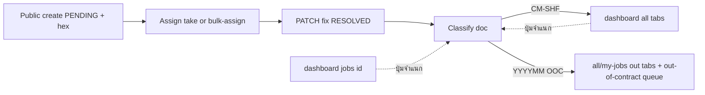

# แผนงาน Requirements จาก Meeting-11082026

**อัปเดต:** 2026-08-17 · แหล่ง: grilling + scrutinize (fix-then-ship) จาก sheet Meeting-11082026 + Running · ล็อก Git branch  
**สถานะ:** Phase A–E ทำแล้ว · **ข้อ 8 Reports ✅** (เทมเพลต PDF CM/SHF) · จำแนกเอกสาร UI: `/dashboard/all` + `/dashboard/jobs/:id` · **Locations master seed จาก MS SQL เข้า MySQL แล้ว** (local; UAT/PRD รันสคริปต์เมื่อ deploy) · แยก `/fix` กับ `/close` + ป้าย「รอเซ็นผู้แจ้ง」

## Goal

ปรับระบบตาม requirements เพิ่มเติมจาก meeting โดยส่งเป็นเฟส และไม่ทำลาย flow ปัจจุบัน (pending / OOC / assign / reopen / MinIO / RBAC)

## Domain

full-stack (Public + Jobs workflow + Sites/Locations + Profile signature + Export)

## Git / Branch

- **Base:** `staging`
- **Branch งาน:** `feat/breaking-docno-locations-signature`
  - สื่อ **breaking** + กองงานหลัก (Doc No / locations / signature)
  - prefix `feat/` → GitLab CI workflow **ข้าม** ทั้ง pipeline ระหว่างพัฒนา (ดู [`.gitlab-ci.yml`](../.gitlab-ci.yml))
- **โครงสร้าง:** branch **เดียวยาว** ทั้ง Phase A–E (ไม่แตก `phase-*` ย่อย)
- **MR เข้า `staging`:** **MR เดียว** เมื่อชุด breaking พร้อมทดสอบบน UAT (เป้าครบ A–E หรืออย่างน้อย A–C + ที่จำเป็น) — เลี่ยง UAT ครึ่งทาง
- **ระหว่างทาง:** commit + scrutinize ต่อเฟสบน feature branch · ไม่ force-push · ไม่ commit ตรง `staging`
- WIP เอกสารบน `staging` ตอนสร้าง branch: **พกไปบน feature branch**

## Decisions จาก grilling / scrutinize

- **Doc No:** สร้างงานออก hex 8 ตัว · มอบหมาย/รับงาน/ย้าย OOC **ไม่** gen Running Doc No · ออกเลขทางการครั้งเดียวตอนจำแนกเอกสารหลัง `RESOLVED` (`PATCH /jobs/:id/classify-doc`, สิทธิ์ `job.classifyDoc`) · Reopen ไม่ gen ใหม่
- **Format:** ในสัญญา `CM-SHF-YYYY-` + running ไม่รีเซ็ต (YYYY = Asia/Bangkok ณ วันจำแนก) · นอกสัญญา `YYYYMM` (Asia/Bangkok) + running · running ใช้ `padStart(4, '0')` (ขั้นต่ำ 4 หลัก; เกิน 9999 → 5 หลัก, เกิน 99999 → 6 หลัก, โตตามค่าจริงไม่มีเพดาน; ไม่ wrap / ไม่ throw เพราะจำนวนหลัก) · เลขเก่า `CM-SHF-2002-…` ยังถือว่าเป็นเลขทางการ
- **Location:** เพิ่ม `Subdistrict` · cascade 5 ขั้น (จังหวัด→อำเภอ→ตำบล→สถานที่/หน่วยงาน→ชื่อสถานี) · `Site.agency` + `Site.station` · `Job.agency` + `Job.location`(station) · import `Sites.xlsx`
- **Signature:** ลายเซ็นเจ้าหน้าที่ที่ profile (MinIO) · hard gate เฉพาะ assign / bulk-assign / OOC / fix / reopen · ดูได้อย่างเดียว · ลายเซ็นผู้แจ้งเก็บต่อ job ตอนปิดงาน · **ไม่** บล็อกลบงาน / `updateStatus`
- **Email optional:** identity หลักเป็นเบอร์ · เมื่อไม่มีอีเมลตั้ง `User.username = phone` (normalize เดียวกับ `phone`) · มีอีเมลแล้วอัปเดต `email` ได้ แต่ **ไม่บังคับย้าย username** ตามอีเมล · ข้ามอีเมลแจ้งเตือนถ้าไม่มีที่อยู่ (ใช้ logic ใน `job-email-notification.service` ที่มีอยู่)
- **Phasing:** ตามลำดับด้านล่าง · ข้อ 8 Reports เลื่อนจนกว่าจะได้ตัวอย่างข้อมูล

### Defaults ที่ล็อกในแผน

- งานเก่าที่ `ticketNo` เป็น hex 8 ตัว: **คงเดิม ไม่ backfill**
- Export บน `/dashboard/all`: คง **CSV UTF-8 BOM** (เปิดใน Excel ได้ตาม remark) + เพิ่มคอลัมน์ระยะเวลา — ไม่บังคับย้ายเป็น `.xlsx` ในรอบนี้
- ระยะเวลาจบงาน: `fixDate − reportDate` (fallback `createdAt`) แสดงเมื่อมี `fixDate` (หน่วยวัน)
- เมนู master ใหม่: `/dashboard/locations` + permission `menu.locations` (แยกจาก `/dashboard/sites`)
- Locations เขียน: ใช้ **`location.create`** (POST จังหวัด/อำเภอ/ตำบล) — แยกจาก `site.create`; อ่าน provinces/districts/subdistricts สำหรับ dropdown ตามแบบ public `GET` ที่มีอยู่
- งาน PENDING ที่ยังไม่มีเลข: ไม่เกิดแล้ว (create ออก hex) · Running Doc No แทนที่ hex ตอนจำแนกหลังปิดงาน
- จำแนกเอกสาร: ครั้งเดียว · ADMIN/SUPERVISOR (`job.classifyDoc`) + ลายเซ็นโปรไฟล์ · UI บน `/dashboard/all` และ `/dashboard/jobs/:id` · งาน `RESOLVED` นอกสัญญาที่จำแนกแล้วไปคิวย่อ `/dashboard/out-of-contract` และ**ยังโชว์**บน `/dashboard/all` / `/dashboard/my-jobs` (แท็บ「ทั้งหมด」/「นอกสัญญา」; อัปเดต 2026-09 — ไม่ซ่อนจากประวัติแล้ว)
- Phase E go-live: ทีมตั้งลายเซ็นที่ profile ก่อนเปิดใช้คิว (ไม่มี grace period ในโค้ด)
- หลัง deploy ที่มี `menu.locations`: รัน seed RBAC (`backend/scripts/seed-roles-permissions.ts`) บน env นั้น
- หลัง deploy ที่ Locations ว่าง: รัน `backend/scripts/seed-locations-from-mssql.ts` (ต้องมี `scripts/data/TB_MST_*.sql`) — ดู [`Locations-Master-Seed.md`](./Locations-Master-Seed.md)
- หลัง migration `Site.station` / `Job.agency`: รัน `npm run script:seed-sites-xlsx` (ไฟล์ `scripts/data/Sites.xlsx`) — ดู [`Sites-Import.md`](./Sites-Import.md) · **local ✅ 198 แถว (2026-08-14)**
- Scrutinize (pre-MR): public redirect ด้วยเบอร์เมื่อยังไม่มี Doc No; บล็อก `RESOLVED` ผ่าน `PATCH …/status`; จำกัด `GET /users/:id/signature`; harden `DocSequence`

---

## Checklist เฟส

- [x] **Phase A** — อีเมล/รูป optional + ป้ายชื่อสถานี + ensureReporter จากเบอร์ (`username = phone`)
- [x] **Phase B** — Subdistrict + cascade + เมนู `/dashboard/locations` + ผูกฟอร์ม Site/public
- [x] **Phase C** — DocSequence + hex ตอน create; Running Doc No ตอนจำแนกเอกสารหลัง RESOLVED (`job.classifyDoc`)
- [x] **Phase D** — รูปปัญหาใน wrench/detail (`job.issue.upload`, PENDING+IN_PROGRESS, เติมถึง 3) + คอลัมน์/CSV ระยะเวลาจบงาน
- [x] **Phase E** — ลายเซ็น profile + hard gate (assign/bulk/OOC/fix/reopen) + เซ็นผู้แจ้งตอนปิดงาน
- [x] **Follow-up** — แยกบันทึกการแก้ไข (`PATCH /jobs/:id/fix`) กับปิดงาน (`PATCH /jobs/:id/close`); ลายเซ็นผู้แจ้งที่ `/dashboard/jobs/:id` และปุ่ม Sign ใน `JobsList` เมื่อรอเซ็น
- [x] **ข้อ 8 Reports** — เทมเพลต PDF CM (SHF): `JobMaintenancePdfTemplate` + `PdfReportHeader` + `reportPdfConstants.ts` + `logo-FORTH.png`
- [x] ป้าย「รอเซ็นผู้แจ้ง」ในรายการงาน (`JobsList`) เมื่อ `IN_PROGRESS` แต่ข้อมูลแก้ไขครบ — ไม่เพิ่มสถานะใหม่ — [`TASK.md`](../TASK.md) §34

---

## สถานะปัจจุบัน (ช่องว่างหลัก)

| หัวข้อ | สถานะโค้ด (branch นี้) | หมายเหตุ |
|--------|------------------------|----------|
| Email / รูป public | ✅ optional | — |
| Reporter username | ✅ = phone เมื่อไม่มีอีเมล | — |
| ตำบล + cascade | ✅ | UAT/PRD รัน locations seed ถ้ายังว่าง |
| ป้ายหน่วยงาน / station | ✅ `agency` + `station` | UAT/PRD รัน Sites.xlsx seed ถ้าต้อง |
| `ticketNo` / Doc No | ✅ hex ตอนสร้าง · Running ตอนจำแนกหลังปิดงาน | UI: `/all` + job detail |
| Wrench + duration CSV | ✅ | รูปปัญหา: `job.issue.upload` · PENDING/IN_PROGRESS · เติมถึง 3 · **5MB/HEIC** · fallback 413 |
| ลายเซ็น | ✅ profile + gate + เซ็นปิดงานที่ `/dashboard/jobs/:id` หรือปุ่ม Sign ใน `JobsList` (`PATCH /close`) | ป้าย「รอเซ็นผู้แจ้ง」ในรายการเมื่อแก้ครบแล้วยัง `IN_PROGRESS` |
| ข้อ 8 Reports | ✅ | PDF CM/SHF — `/print/jobs/[id]`; แทน copy CCTV; โลโก้ `logo-FORTH.png` (พื้นโปร่งใส) |

ไฟล์แกน: [`frontend/src/app/public/report/page.tsx`](../frontend/src/app/public/report/page.tsx) · [`backend/src/jobs/jobs.service.ts`](../backend/src/jobs/jobs.service.ts) · [`frontend/src/components/JobsList.tsx`](../frontend/src/components/JobsList.tsx) · [`frontend/src/components/jobs/JobClassifyDocDialog.tsx`](../frontend/src/components/jobs/JobClassifyDocDialog.tsx) · [`frontend/src/app/dashboard/jobs/[id]/page.tsx`](../frontend/src/app/dashboard/jobs/[id]/page.tsx) · [`backend/prisma/schema.prisma`](../backend/prisma/schema.prisma) · [`frontend/src/app/dashboard/sites/page.tsx`](../frontend/src/app/dashboard/sites/page.tsx) · [`frontend/src/app/dashboard/profile/page.tsx`](../frontend/src/app/dashboard/profile/page.tsx) · [`backend/src/users/users.service.ts`](../backend/src/users/users.service.ts) · [`backend/src/locations/locations.controller.ts`](../backend/src/locations/locations.controller.ts)

---

## เฟสงาน

### Phase A — Public quick wins (ข้อ 1, 3 + ป้ายชื่อสถานี)

- FE: ผ่อน required อีเมล/รูปใน [`public/report/page.tsx`](../frontend/src/app/public/report/page.tsx); เปลี่ยนป้ายเป็น「ชื่อสถานี」
- BE: `CreateJobSchema` ให้ `reporterEmail` optional (ว่างหรือไม่ส่งได้; ถ้าระบุต้องเป็นอีเมลถูกต้อง)
- ปรับ [`ensureReporterUserFromPublicReport`](../backend/src/users/users.service.ts):
  - ผูก/สร้างจากเบอร์เมื่อไม่มีอีเมล
  - ไม่มีอีเมล → `username = phone` (normalize เดียวกับ `phone`); `email` คง `null`
  - มีอีเมล → อัปเดต `email` ได้; **ไม่บังคับ** ตั้ง `username = email`
  - ห้าม overwrite `username` เป็นสตริงว่าง
- ข้ามส่งอีเมลแจ้งเตือนเมื่อไม่มีที่อยู่: คงพฤติกรรมใน [`job-email-notification.service.ts`](../backend/src/jobs/job-email-notification.service.ts) (ไม่ต้องทำซ้ำ logic)

### Phase B — Location master + Site (ข้อ 2, 9, 10)

- Prisma: เพิ่ม `Subdistrict` (`districtId` + `name`, unique ต่ออำเภอ); เพิ่ม `Site.subdistrict` / `Job.subdistrict` เป็น string (denormalize)
- API: ขยาย [`locations`](../backend/src/locations/locations.controller.ts) (province → district → subdistrict) — create ที่จำเป็น; เขียนใช้ **`location.create`** (ไม่ใช่ `site.create`); อ่านสำหรับ dropdown ตามแบบ public `GET /locations/provinces` ที่มีอยู่
- หน้าใหม่ `/dashboard/locations` + เมนู sidebar (`menu.locations` + seed); ย้ายบล็อกจังหวัด–อำเภอออกจากหน้า sites (หรือลิงก์ไปหน้าใหม่)
- ฟอร์ม Site + public report: select cascade จังหวัด→อำเภอ→ตำบล→สถานที่/หน่วยงาน→ชื่อสถานี; UI ทำงานได้แม้รายการตำบลว่าง
- Seed จังหวัด/อำเภอ/ตำบล: ✅ dump MS SQL ใน `backend/scripts/data/TB_MST_*.sql` → `scripts/seed-locations-from-mssql.ts` (`DRY_RUN=1` ได้) — คู่มือ [`Locations-Master-Seed.md`](./Locations-Master-Seed.md)
- Cascade API: lazy-load (`GET /locations/provinces` แค่จังหวัด + districts/subdistricts แยก) — public แสดงจังหวัดจาก Site เท่านั้น (fix-then-ship หลัง seed เต็มประเทศ)

### Phase C — Doc No running (ข้อ 4 + sheet Running) — ปรับ 2026-08-14

- สร้างงาน: `ticketNo` = hex 8 ตัว (`randomBytes(4)`) — ตัด `ticketNo` จาก client
- มอบหมาย / รับงาน / bulk-assign / ย้าย PENDING นอกสัญญา: **ไม่** ออก Running Doc No
- จำแนกเอกสารครั้งเดียวหลัง `RESOLVED`: `PATCH /jobs/:id/classify-doc` + `job.classifyDoc` (ADMIN/SUPERVISOR) + ลายเซ็นโปรไฟล์
  - UI: `/dashboard/all` + `/dashboard/jobs/:id` (`JobClassifyDocDialog` — เลือกประเภทแล้วยืนยัน)
  - ในสัญญา `CM-SHF-YYYY-XXXX` · นอกสัญญา `YYYYMM####` · แทนที่ hex
  - งานนอกสัญญาที่จำแนกแล้ว → คิวย่อ `/dashboard/out-of-contract` และ**ยังโชว์**บน `/dashboard/all` / `/dashboard/my-jobs` (แท็บ「ทั้งหมด」/「นอกสัญญา」; อัปเดต 2026-09)
  - จากหน้ารายละเอียด: อยู่หน้าเดิม + รีโหลดเลข (ถือสำเร็จเมื่อเป็นเลขทางการแล้ว)
- Padding: `String(n).padStart(4, '0')` — ขั้นต่ำ 4 หลัก แล้วโตตามค่าจริง; `YYYYMM` จาก Asia/Bangkok
- อัปเดต [`System-Workflow.md`](./System-Workflow.md) ให้ตรง flow นี้
- Reopen: คง `ticketNo` เดิม (ไม่ gen ใหม่)

### Phase D — Jobs UX + export (ข้อ 5, 6, 7)

- Wrench modal ใน [`JobsList.tsx`](../frontend/src/components/JobsList.tsx): แสดง `Job.images` + อัปโหลดรูปปัญหาเมื่อมี **`job.issue.upload`** และงานเป็น `PENDING` หรือ `IN_PROGRESS` (reuse `/job-images` + `PATCH /jobs/:id/issue-images`) — แยกชิ้นส่วนให้เล็กที่สุดเพราะเป็น shared host; ปุ่ม wrench เปิดอัปเดตได้เมื่อ `IN_PROGRESS` + ผู้รับงาน ดังนั้นอัปโหลดตอน PENDING ใช้หน้า job detail
- หน้า [`/dashboard/jobs/[id]`](../frontend/src/app/dashboard/jobs/[id]/page.tsx): อัปโหลดรูปปัญหาได้เมื่อมีสิทธิ์และสถานะอนุญาต — **เติมช่องว่างถึง 3 รูป** ไม่ลบ/ไม่แทนที่รูปเดิม; หน้า public ยังไม่บังคับรูป
- จำกัดไฟล์ (2026-08-17): **5MB/ไฟล์** · JPG/PNG/WebP (magic bytes) · HEIC/HEIF→JPEG ฝั่ง Nest; frontend pre-check + บีบรูป fallback เมื่อ NPM **413** (~1MB default)
- Seed: แคตตาล็อก + **ADMIN**; STAFF/SUPERVISOR **ไม่ได้** สิทธิ์นี้โดยอัตโนมัติ — ติ๊กที่ `/dashboard/roles`
- [`jobsListCsvExport.ts`](../frontend/src/lib/jobsListCsvExport.ts) + คอลัมน์ตาราง `/dashboard/all`: เพิ่ม「ระยะเวลาจบงาน」

### Phase E — Electronic signature (ข้อ 11, 12)

- Prisma: `User.signature` (MinIO key/URL) · `Job.reporterSignature` (+ เวลาเซ็นถ้าต้องการ)
- Profile: วาด/อัปโหลดลายเซ็น (pad รองรับ touch)
- Gate: FE เตือนก่อน action + BE ปฏิเสธเฉพาะ **assign / bulk-assign / OOC / fix / reopen / classify-doc** ถ้าผู้กระทำไม่มีลายเซ็นเจ้าหน้าที่ — ไม่บล็อกลบงาน / `PATCH .../status`; ดูรายการ/รายละเอียดได้อย่างเดียว
- ปิดงาน: บันทึกการแก้ไขด้วย `PATCH .../fix` (คง `IN_PROGRESS`) แล้วบังคับลายเซ็นผู้แจ้งบน pad ก่อน `PATCH .../close` → `RESOLVED`; UI ที่ `/dashboard/jobs/:id` และปุ่ม Sign ใน `JobsList` เมื่อรอเซ็น; เก็บต่อ job; รองรับ laptop/iPad/mobile; รายการงานมีป้าย「รอเซ็นผู้แจ้ง」เมื่อแก้ครบแล้วยังกำลังแก้ไข
- PDF ปิดงาน: ฝังลายเซ็นผู้แจ้ง/เจ้าหน้าที่เมื่อมี (phase ย่อยหลังเก็บได้)
- Go-live: ทีมตั้งลายเซ็นที่ profile ก่อนเปิดใช้ (ไม่มี grace period ในโค้ด)

### Deferred

- _(ไม่มี — ข้อ 8 Reports ปิดแล้ว 2026-08-17)_

---

## ความเสี่ยง / เปิดค้าง

- ~~ข้อมูลตำบลยังรอไฟล์ seed~~ → **ปิดแล้ว (2026-08-14):** มี dump + seed script; หลัง deploy UAT/PRD ต้องรัน `seed-locations-from-mssql.ts` บน env นั้น (ถ้ายังไม่มีข้อมูล)
- Phase E go-live: เจ้าหน้าที่ที่ยังไม่มีลายเซ็นจะทำ assign/OOC/fix/reopen/จำแนกเอกสาร ไม่ได้จนกว่าจะตั้งที่ profile
- Counter ต้องใช้ transaction/unique เพื่อกันเลขซ้ำตอน concurrent จำแนกเอกสาร
- Running ความกว้างไม่คงที่หลัง 9999 — ห้ามใช้ string sort ของ `ticketNo` เป็นลำดับเวลา (ใช้ `createdAt` / `id`)

## Next step

1. ชุด breaking (A–E) พร้อม UAT → MR เข้า `staging` เมื่อขอ
2. หลัง deploy UAT: รัน `npx ts-node scripts/seed-locations-from-mssql.ts` (ถ้า Locations ว่าง) + `seed-roles-permissions.ts` (ถ้ายังไม่มี `menu.locations` / `job.classifyDoc` / **`job.issue.upload`**) — หรือ restart backend เพื่อ `ensurePermissionCatalogSynced` แล้วติ๊กบทบาทที่ `/dashboard/roles`; **`npm install` ใน backend** (มี `file-type` / `heic-convert`); ทดสอบอัปโหลดจากมือถือ — fallback บีบรูปทำงานแม้ยังไม่ได้ตั้ง NPM `client_max_body_size 50m`
3. optional **review-bugbot** / **scrutinize** ก่อน merge ตามความเหมาะสม
