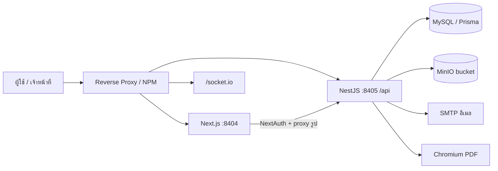
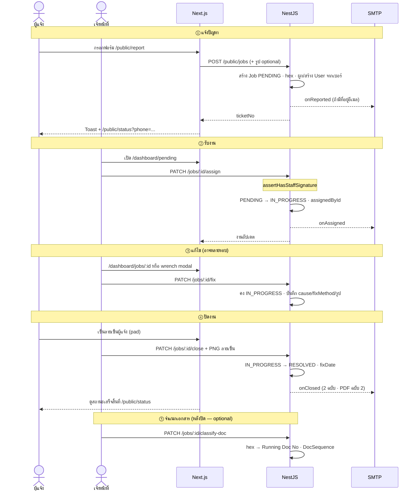
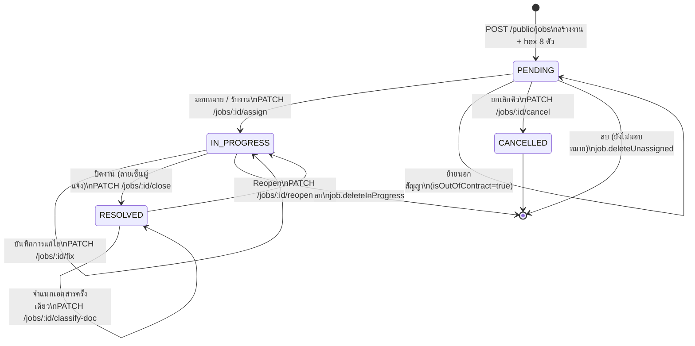
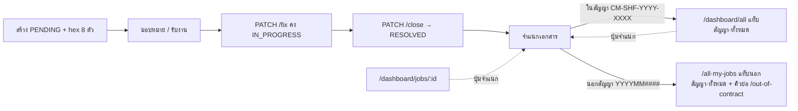
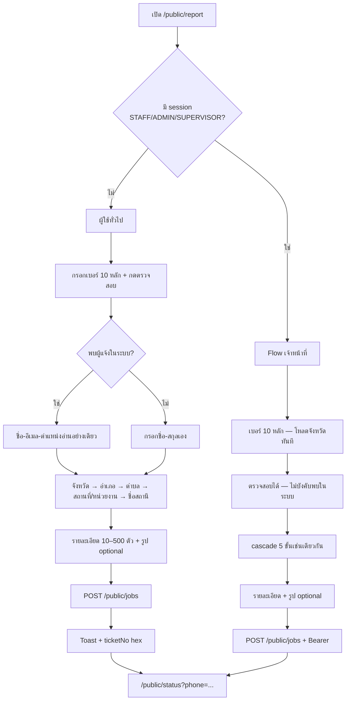
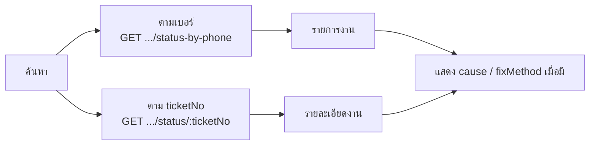
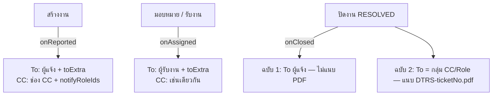
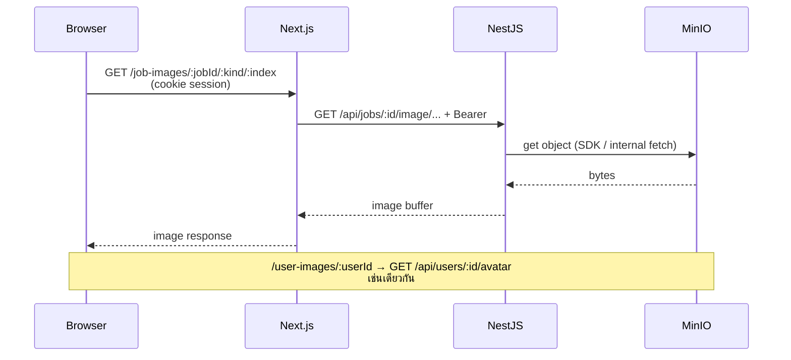
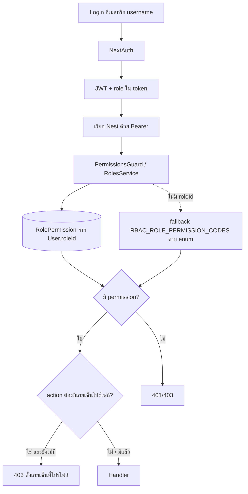
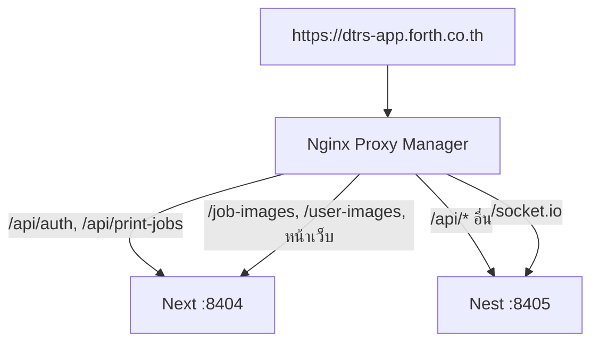

# System Workflow (dtrs-app)

แผนภาพและลำดับงานหลักของระบบแจ้งซ่อม CCTV — ใช้เป็นจุดรวมอ้างอิงสำหรับทีมและ AI Agent

**อัปเดต:** 2026-08-18  
**Production:** `https://dtrs-app.forth.co.th`

เอกสารนี้ **สรุป flow** ไม่แทนที่รายละเอียด API/RBAC/env — ดูลิงก์ท้ายเอกสารเมื่อต้องลงลึก

---

## 1. ภาพรวมสถาปัตยกรรม



| ชั้น | หน้าที่ |
|------|---------|
| **Frontend** | Next.js 15 — หน้า public / dashboard / print; NextAuth; proxy `/job-images`, `/user-images` |
| **Backend** | NestJS — REST `/api/*`, JWT+RBAC, Socket.IO, อัปโหลด MinIO, ส่งอีเมล, สร้าง PDF |
| **Data** | MySQL (`Job`, `User`, `Site`, `Setting`, RBAC, `Province`/`District`/`Subdistrict`, `DocSequence`) + MinIO (รูปงาน/โปรไฟล์/ลายเซ็น) |

รายละเอียด path proxy: [`../backend/docs/Reverse-Proxy-Nginx-Proxy-Manager.md`](../backend/docs/Reverse-Proxy-Nginx-Proxy-Manager.md)

---

## 2. Flow ครบวงจร: แจ้งปัญหา → ปิดงาน

แผนภาพรวมเส้นทางหลักตั้งแต่ผู้แจ้งส่งคำร้องจนงาน **ปิด (`RESOLVED`)** — รายละเอียดย่อยแยกใน section 4–6

### 2.1 แผนภาพรวม (Happy path + ทางแยกสำคัญ)

```mermaid
flowchart TD
  Start([ผู้แจ้งเปิด /public/report]) --> Form[กรอกเบอร์ · เลือกสถานที่ 5 ขั้น · รายละเอียด 10–500 ตัว]
  Form --> Submit[POST /public/jobs]
  Submit --> Create["Job สร้างแล้ว<br/><b>PENDING</b> + ticketNo hex 8 ตัว"]
  Create --> Email1[อีเมล onReported<br/>ถ้ามีอีเมลผู้แจ้ง / To เพิ่มเติม]
  Create --> StatusPage[redirect /public/status?phone=...]

  Create --> Pending["คิว /dashboard/pending<br/>หรือ /dashboard/out-of-contract ถ้า OOC"]

  Pending --> CancelBranch{ยกเลิกคิว?<br/>job.cancel}
  CancelBranch -->|ใช่| Cancelled["<b>CANCELLED</b><br/>PATCH /cancel"]
  CancelBranch -->|ไม่| SigGate{เจ้าหน้าที่มี<br/>ลายเซ็นโปรไฟล์?}
  SigGate -->|ไม่| Profile[ตั้งที่ /dashboard/profile]
  Profile --> SigGate
  SigGate -->|ใช่| AssignChoice{มอบหมาย / รับงาน}
  AssignChoice -->|job.assign| AssignOther[PATCH /assign → ช่างคนอื่น]
  AssignChoice -->|menu.pending| SelfTake[PATCH /assign → รับเอง]
  AssignOther --> InProg["<b>IN_PROGRESS</b>"]
  SelfTake --> InProg
  InProg --> Email2[อีเมล onAssigned]

  InProg --> IssueOpt["optional: เติมรูปปัญหา<br/>PATCH /issue-images<br/>(job.issue.upload)"]
  IssueOpt --> OnSite[ช่างแก้ไขหน้างาน]
  OnSite --> FixSave["PATCH /fix<br/>Indoor/Outdoor · Hardware/Software<br/>cause · fixMethod · รูปแก้ ≥ 2"]
  FixSave --> StillIP[ยัง <b>IN_PROGRESS</b>]
  StillIP --> Badge["ป้าย 「รอเซ็นผู้แจ้ง」<br/>ใน JobsList / my-jobs / in-progress"]

  Badge --> SignChoice{เซ็นที่ไหน}
  SignChoice -->|รายการ| ListSign["JobsList ปุ่ม Sign<br/>dialog ลายเซ็นผู้แจ้ง"]
  SignChoice -->|รายละเอียด| JobDetail[/dashboard/jobs/:id]
  ListSign --> ReporterSign[ผู้แจ้งเซ็นบน pad]
  JobDetail --> ReporterSign
  ReporterSign --> CloseAPI[PATCH /close<br/>+ ลายเซ็นเจ้าหน้าที่ในโปรไฟล์]
  CloseAPI --> Resolved["<b>RESOLVED</b> + fixDate"]
  Resolved --> Email3["อีเมล onClosed<br/>ฉบับ 1 → ผู้แจ้ง (ไม่แนบ PDF)<br/>ฉบับ 2 → CC/Role + PDF"]
  Resolved --> PrintOpt[พิมพ์ /print/jobs/:id<br/>หรือดาวน์โหลด PDF]

  Resolved --> ClassifyQ{จำแนกเอกสาร?<br/>job.classifyDoc}
  ClassifyQ -->|ใช่| Classify["PATCH /classify-doc<br/>hex → CM-SHF-YYYY-XXXX<br/>หรือ YYYYMM####"]
  ClassifyQ -->|ไม่| Done([จบ flow ปิดงาน])
  Classify --> Done

  Resolved --> ReopenQ{Reopen?<br/>job.reopen.*}
  ReopenQ -->|ใช่| Reopen["PATCH /reopen → IN_PROGRESS<br/>ล้าง fixDate + ลายเซ็นผู้แจ้ง"]
  Reopen --> OnSite

  StatusPage -.->|ติดตามสถานะ| RCheck[/public/status<br/>cause/fixMethod เมื่อมี]
```

| ขั้น | สถานะ | ผู้ทำ | หน้า / API หลัก |
|------|--------|--------|------------------|
| 1 แจ้งปัญหา | → `PENDING` | ผู้แจ้ง / เจ้าหน้าที่ | `/public/report` → `POST /public/jobs` |
| 2 คิวรอดำเนินการ | `PENDING` | เจ้าหน้าที่ | `/dashboard/pending` |
| 3 มอบหมาย / รับงาน | → `IN_PROGRESS` | SUPERVISOR / ช่าง | `PATCH /jobs/:id/assign` |
| 4 บันทึกการแก้ไข | `IN_PROGRESS` | ผู้รับงาน | `PATCH /jobs/:id/fix` |
| 5 ปิดงาน | → `RESOLVED` | ผู้รับงาน + ผู้แจ้งเซ็น | `JobsList` ปุ่ม Sign หรือ `/dashboard/jobs/:id` → `PATCH /close` |
| 6 จำแนกเอกสาร (optional) | `RESOLVED` | ADMIN/SUPERVISOR | `PATCH /classify-doc` |

### 2.2 ลำดับเวลา (Sequence — ผู้เกี่ยวข้อง)



### 2.3 แผนภาพตามบทบาท (Swimlane)

```mermaid
flowchart LR
  subgraph Reporter [ผู้แจ้ง Public]
    direction TB
    R1[/public/report] --> R2[ส่งคำร้อง]
    R2 --> R3[/public/status ติดตาม]
    R4[เซ็นตอนปิดงาน] --> R3
  end

  subgraph Backend [ระบบ]
    direction TB
    B1[PENDING + hex] --> B2[อีเมล / MinIO]
    B2 --> B3[IN_PROGRESS]
    B3 --> B4[RESOLVED + PDF]
    B4 --> B5[Running Doc No optional]
  end

  subgraph Staff [เจ้าหน้าที่]
    direction TB
    S1[/dashboard/pending] --> S2[assign / รับงาน]
    S2 --> S3[PATCH /fix]
    S3 --> S4[JobsList Sign /jobs/:id ปิดงาน]
    S4 --> S5[classify-doc optional]
  end

  R2 --> B1
  B1 --> S1
  S2 --> B3
  S3 --> S4
  R4 --> S4
  S4 --> B4
  S5 --> B5
  B3 -.-> R3
  B4 -.-> R3
```

---

## 3. Lifecycle งานซ่อม (หลัก)

สถานะหลัก: **`PENDING` → `IN_PROGRESS` → `RESOLVED`** (+ **Reopen** กลับ `IN_PROGRESS`)  
ทางแยก: **`PENDING` → `CANCELLED`** (ยกเลิกคิว — ไม่กลับสถานะผ่าน `PATCH /status`)

ธงเสริม: **`isOutOfContract`** (นอกสัญญา) — ย้ายตอน `PENDING` ได้โดยไม่เปลี่ยนสถานะ; หรือตั้งตอนจำแนกเอกสารหลัง `RESOLVED`

ลายเซ็นเจ้าหน้าที่ที่โปรไฟล์ (`User.signature`) เป็น **hard gate** ของ assign / bulk-assign / OOC / fix / close / reopen / classify-doc — ไม่บล็อกลบงานหรือ `PATCH /status`



### กติกาสำคัญ

| การกระทำ | API | สิทธิ์หลัก | ผลต่อสถานะ |
|----------|-----|------------|------------|
| สร้างงาน | `POST /public/jobs` (หน้า report; JWT เสริมได้) | สาธารณะ / Bearer | → `PENDING` + `ticketNo` hex 8 ตัว; ผูก/สร้างผู้แจ้งจากเบอร์ (`username = phone` เมื่อไม่มีอีเมล) |
| มอบหมายให้ผู้อื่น | `PATCH /jobs/:id/assign` | `job.assign` + ลายเซ็นโปรไฟล์ | งานยังไม่มีผู้รับ → `IN_PROGRESS`; บันทึก `assignedById`; **ไม่** ออก Running Doc No |
| รับงานเอง | `PATCH /jobs/:id/assign` (ตัวเอง) | `menu.pending` (หรือมี `job.assign`) + ลายเซ็น | เช่นเดียวกับมอบหมาย |
| ย้ายนอกสัญญา | `PATCH /jobs/:id/out-of-contract` | `job.assign` + ลายเซ็น | คง `PENDING`, ตั้ง `isOutOfContract`; **ไม่** ออกเลข — **ไม่มีปุ่ม** บน `/dashboard/pending` |
| ยกเลิกคิว | `PATCH /jobs/:id/cancel` | `job.cancel` | `PENDING` → `CANCELLED`; งานที่ยกเลิกแล้วเปลี่ยนสถานะต่อไม่ได้ |
| จำแนกเอกสาร | `PATCH /jobs/:id/classify-doc` | `job.classifyDoc` + `.contract` / `.outOfContract` + ลายเซ็น | เฉพาะ `RESOLVED` ที่ยังเป็น hex; แทนที่ `ticketNo` ด้วย `CM-SHF-YYYY-XXXX` หรือ `YYYYMM####` ครั้งเดียว + ตั้ง `isOutOfContract`; UI: `/dashboard/all` + `/dashboard/jobs/:id` |
| อัปโหลดรูปปัญหาที่แจ้ง | `PATCH /jobs/:id/issue-images` | `job.issue.upload` | งาน `PENDING` / `IN_PROGRESS` (รวมยังไม่มีผู้รับ); เติมได้ถึง 3 รูป ไม่ลบ/ไม่แทนที่; **5MB/ไฟล์** JPG/PNG/WebP/HEIC→JPEG; ไม่ใช้ `job.fix.*`; UI: job detail + wrench modal; fallback บีบรูปเมื่อ NPM 413 |
| บันทึกการแก้ไข | `PATCH /jobs/:id/fix` | `job.fix.self` / `job.fix.any` + ลายเซ็น | คง `IN_PROGRESS`; บังคับ Indoor/Outdoor, Hardware/Software, cause, fixMethod และรูปแก้ไข ≥ 2; Serial ไม่บังคับ (สูงสุด 4 แถว) |
| ปิดงาน | `PATCH /jobs/:id/close` | `job.fix.self` / `job.fix.any` + ลายเซ็นเจ้าหน้าที่ | → `RESOLVED` + `fixDate` + ลายเซ็นผู้แจ้ง (PNG) — **ห้าม** ตั้ง `RESOLVED` ผ่าน `PATCH /status` |
| Reopen | `PATCH /jobs/:id/reopen` | `job.reopen.self` / `job.reopen.any` + ลายเซ็น | → `IN_PROGRESS`; ล้าง `fixDate` + ลายเซ็นผู้แจ้ง; **คง** `ticketNo` เดิม |
| เปลี่ยนสถานะโดยตรง | `PATCH /jobs/:id/status` | `job.updateStatus` | ตาม payload — **ปฏิเสธ** `RESOLVED` และงานที่เป็น `CANCELLED` |
| มอบหมายหลายงาน | `POST /jobs/bulk-assign` | เดียวกับ assign + ลายเซ็น | สูงสุด 50 รายการ |

หมายเหตุข้อมูล import: งาน `IN_PROGRESS` / `RESOLVED` ที่ยังไม่มี `assignedToId` ตั้งผู้รับได้ — ผลคือ **`IN_PROGRESS`** (กรณีเดิม `RESOLVED` จะล้าง `fixDate`)

รายละเอียด RBAC: [`../backend/docs/RBAC-Setup.md`](../backend/docs/RBAC-Setup.md) · API: [`../STATUS.md`](../STATUS.md)

### 3.1 เลขที่เอกสาร (hex → Running Doc No)

สร้างงานออก hex เสมอ · มอบหมาย / รับงาน / ย้าย OOC / Reopen **ไม่** gen เลขใหม่ · ออกเลขทางการครั้งเดียวตอนจำแนกหลังปิดงาน



- ในสัญญา: `CM-SHF-YYYY-` + running ไม่รีเซ็ต (ปี = Asia/Bangkok ณ วันจำแนก) · นอกสัญญา: `YYYYMM` (Asia/Bangkok) + running รายเดือน · เลขเก่า `CM-SHF-2002-…` ยังถือว่าเป็นเลขทางการ
- Padding: `padStart(4, '0')` แล้วโตตามค่าจริง (เกิน 9999 → 5 หลัก … ไม่ wrap)
- งาน `RESOLVED` นอกสัญญาที่จำแนกแล้ว **โชว์** บน `/dashboard/all` และ `/dashboard/my-jobs` (แท็บ「ทั้งหมด」/「นอกสัญญา」) และยังอยู่ในคิวย่อ `/dashboard/out-of-contract` (`PENDING` OOC + RESOLVED OOC ที่จำแนกแล้วเท่านั้น — แท็บประวัติอาจเป็น **superset** รวมสถานะ OOC อื่น)

### 3.2 ลายเซ็นอิเล็กทรอนิกส์

| ชนิด | ที่เก็บ | เมื่อใช้ |
|------|---------|----------|
| เจ้าหน้าที่ | `User.signature` (MinIO) ตั้งที่ `/dashboard/profile` | Gate ก่อน assign / bulk / OOC / fix / close / reopen / classify-doc |
| ผู้แจ้ง | `Job.reporterSignature` (+ `reporterSignedAt`) | บังคับตอน `PATCH /close` — UI ที่ `/dashboard/jobs/:id` หรือปุ่ม Sign ใน `JobsList` |

รายการงานแสดงป้าย「รอเซ็นผู้แจ้ง」เมื่อ `IN_PROGRESS` และข้อมูลแก้ไขครบแล้ว — **ไม่ใช่สถานะใหม่**  
`GET /users/:id/signature` จำกัดเฉพาะตัวเอง / `menu.users` / สิทธิ์เมนูงาน (บล็อกผู้แจ้งดึงลายเซ็นเจ้าหน้าที่คนอื่น)

---

## 4. Flow แจ้งซ่อม (Report)

หน้า: **`/public/report`** (เส้นทางเดิม `/report` redirect ได้)

อีเมลและรูปประกอบเป็น **optional** · รายละเอียดอาการ 10–500 ตัวอักษร · cascade สถานที่ **5 ขั้น** จาก Site (`GET /sites/options/*`) ไม่โหลด `/sites` ทั้งก้อน



- ส่ง `agency` (สถานที่/หน่วยงาน) + `location` (ชื่อสถานี); ถ้าไม่เลือกตำบล API เติมจาก Site ที่ match (`whenSubdistrictEmpty: 'any'`)
- รูปข้อขัดข้องอัปโหลด MinIO → `Job.images` (**สูงสุด 3 รูป · 5MB/ไฟล์ · JPG/PNG/WebP/HEIC→JPEG** — ตรวจทั้ง UI และ API)
- ถ้า reverse proxy ยัง default ~1MB: frontend บีบรูปแล้ว retry หลัง **413** — [`../backend/docs/Reverse-Proxy-Nginx-Proxy-Manager.md`](../backend/docs/Reverse-Proxy-Nginx-Proxy-Manager.md)
- Public lookup ผู้แจ้ง: ไม่ส่ง URL รูป MinIO (`image: null`)
- ไม่มีอีเมล: ข้ามแจ้งเตือน `onReported` ถ้าไม่มี To เพิ่มเติมด้วย

---

## 5. Flow ตรวจสอบสถานะ (Public)

หน้า: **`/public/status`**



โหมดสาธารณะมาสก์ข้อมูลส่วนตัว/รูปตามที่ API ส่ง; เจ้าหน้าที่ที่ล็อกอินอาจเห็นรูปผ่าน proxy ตามสิทธิ์

---

## 6. Dashboard — หน้าจอตามคิวงาน

```mermaid
flowchart TD
  Login[/login → NextAuth → JWT] --> Dash[/dashboard]
  Dash --> Pend[/dashboard/pending\nPENDING ในสัญญา]
  Dash --> OOC[/dashboard/out-of-contract\nPENDING OOC +\nRESOLVED OOC จำแนกแล้ว]
  Dash --> Prog[/dashboard/in-progress\nIN_PROGRESS]
  Dash --> My[/dashboard/my-jobs\nงานที่รับผิดชอบ]
  Dash --> All[/dashboard/all\nทั้งหมด + bulk-assign +\nจำแนกเอกสาร + CSV]
  Pend --> Job[/dashboard/jobs/:id]
  OOC --> Job
  Prog --> Job
  My --> Job
  All --> Job
  Job --> Print[/print/jobs/:id\nเมื่อ RESOLVED]
  Job --> Classify[PATCH .../classify-doc\nRESOLVED + hex]
  Job --> IssueImg[PATCH .../issue-images\nPENDING หรือ IN_PROGRESS]
  Job --> Fix[PATCH .../fix\nคง IN_PROGRESS]
  Job --> Close[PATCH .../close\nลายเซ็นผู้แจ้ง → RESOLVED]
  Job --> Reopen[PATCH .../reopen]
```

| หน้า | โฟกัส |
|------|--------|
| `/dashboard` | สถิติ / กราฟ / เมนูด่วนตาม RBAC (รวมสถานะ `CANCELLED`) — สรุป + `summary-pdf` ตาม **`job.viewContractTabs`** |
| `/dashboard/pending` | มอบหมาย · รับงาน · ลบไม่มอบหมาย · ยกเลิก (`job.cancel`) — **ไม่มี** ปุ่มย้ายนอกสัญญา (ย้าย OOC หลังปิดงานผ่านจำแนกเอกสาร) |
| `/dashboard/in-progress` | อัปเดตแก้ไข · อัปโหลดรูปปัญหา (`job.issue.upload`) ใน wrench · **ปิดงานจากรายการ** (ปุ่ม Sign เมื่อรอเซ็น, `job.fix.self\|any`) · ลบ IN_PROGRESS (ถ้ามีสิทธิ์) · แท็บทั้งหมด/สัญญา/นอกสัญญา (`job.viewContractTabs`) · ป้าย「รอเซ็นผู้แจ้ง」เมื่อแก้ครบแล้วยัง `IN_PROGRESS` |
| `/dashboard/my-jobs` | งานที่รับผิดชอบ · แท็บทั้งหมด/สัญญา/นอกสัญญา · ป้าย「รอเซ็นผู้แจ้ง」เมื่อแก้ครบแล้วยัง `IN_PROGRESS` · **ปิดงานจากรายการ** (ปุ่ม Sign) หรือเข้าหน้ารายละเอียด |
| `/dashboard/jobs/:id` | รายละเอียดเต็ม · ไทม์ไลน์ · บันทึกการแก้ไข (`PATCH /fix`) · ปิดงาน + ลายเซ็นผู้แจ้ง (`PATCH /close`) · อัปโหลดรูปปัญหา (`job.issue.upload`, `PENDING`/`IN_PROGRESS`) · Backfill วันที่ · พิมพ์ · จำแนกเอกสาร (`RESOLVED` ที่ยังเป็น hex) |
| `/dashboard/all` | ประวัติทั้งหมด · bulk-assign · **ปิดงานจากรายการ** เมื่อรอเซ็น · **จำแนกเอกสาร** (`job.classifyDoc`, dialog เลือกในสัญญา/นอกสัญญาก่อนยืนยัน) · คอลัมน์/CSV「ระยะเวลาจบงาน」(`fixDate − reportDate`) · แท็บทั้งหมด/นอกสัญญารวม RESOLVED OOC ที่จำแนกแล้ว (อาจรวมสถานะ OOC อื่น — **superset** ของคิวเมนู) |
| `/dashboard/out-of-contract` | คิวย่อ: `PENDING` นอกสัญญา + `RESOLVED` นอกสัญญาที่จำแนกแล้ว (`menu.outOfContract`) — ดูประวัติ OOC ครบได้ที่แท็บนอกสัญญาบน `/dashboard/all` |
| `/dashboard/sites` | Site: จังหวัด/อำเภอ/ตำบล + `agency` (สถานที่) + `station` (ชื่อสถานี) — `menu.sites` |
| `/dashboard/locations` | Master จังหวัด/อำเภอ/ตำบล (`menu.locations`) — แยกจาก Sites |
| `/dashboard/profile` | โปรไฟล์ + **ลายเซ็นเจ้าหน้าที่** (ไม่แสดงใน sidebar) |
| `/dashboard/settings` | SMTP · เทมเพลตอีเมล · รหัสผ่านเริ่มต้น · MinIO orphan · `app_meta` |
| `/dashboard/roles` · `/dashboard/users` | จัดการตาม `menu.*` — `User.role` = `VARCHAR` (`AppRole.code`) |

แท็บ **ทั้งหมด / สัญญา / นอกสัญญา** (`SegmentedTabs`) บน `my-jobs` / `all` / `in-progress` แสดงเมื่อมี **`job.viewContractTabs`** (default = สัญญา) — แยกด้วย `Job.isOutOfContract` + badge งานค้าง (ไม่นับ `RESOLVED` / `CANCELLED`; แท็บทั้งหมด = ผลรวม); แท็บทั้งหมดโชว์ป้ายสัญญา/นอกสัญญาในแถว; ไม่มีสิทธิ์ = ไม่มีแท็บ และเห็นแค่งานในสัญญา (รวม KPI/กราฟบน `/dashboard` และ `GET /jobs/reports/summary-pdf`)

---

## 7. Flow อีเมลแจ้งงาน

เงื่อนไขรวม: SMTP ครบ + เทมเพลต `enabled` · ลิงก์ใช้ `publicBaseUrl` หรือ `FRONTEND_BASE_URL`  
ข้ามส่งเมื่อผู้รับหลักไม่มีอีเมลและไม่มี To เพิ่มเติม



เอกสารเต็ม: [`Email-Notifications.md`](./Email-Notifications.md)

---

## 8. Flow รูปภาพ (MinIO private)

Bucket **ไม่**เปิด public read เป็นค่าเริ่มต้น — เบราว์เซอร์ไม่โหลด object URL ตรง



- พิมพ์/PDF ใช้ path `/job-images/...` บน Next (ไม่อยู่ใต้ `/api`) เพื่อให้ `` ส่ง cookie ได้
- ถ้า Nest โหลดจากโดเมน public ไม่ได้ ตั้ง `MINIO_SERVER_FETCH_BASE_URL` (LAN)

รายละเอียด: [`Project-Plan-Private-MinIO-Images.md`](./Project-Plan-Private-MinIO-Images.md) · [`minio.md`](./minio.md)

---

## 9. AuthN / AuthZ (ย่อ)



Sidebar เรียก `GET /roles/me/permissions` แล้ว `unwrapApiData` — ถ้าไม่มีเมนูที่รู้จักเลยจะ fallback ตามบทบาท  
`User.role` เป็น `VARCHAR` เก็บ `AppRole.code` (รวมรหัสที่สร้างเอง เช่น `ADMIN_1`)

---

## 10. พิมพ์รายงาน / PDF

```mermaid
flowchart LR
  UI[ปุ่มพิมพ์บนงาน RESOLVED] --> Page[/print/jobs/:id\nlight theme]
  Page --> Data[GET /api/print-jobs/:id/data → Next]
  Page --> Img[/job-images/... → Nest]
  UI --> PDF[GET /api/jobs/:id/report-pdf]
  PDF --> Pup[Nest + Chromium เปิดหน้า print]
  Pup --> File[ดาวน์โหลด PDF]
```

เทมเพลต: `JobMaintenancePdfTemplate` + `PdfReportHeader` + `print.css` (รายงาน CM/SHF 2 หน้า — หัวโครงการ SHF, ตาราง 5 แถวรวมชื่อสถานี/ตำบล, ฝังลายเซ็นเมื่อมี)

---

## 11. Request path บน Production (โดเมนเดียว)



อย่า strip `/api` ก่อนส่ง Nest — global prefix คือ `api`

---

## 12. CI / Deploy (อ้างอิง)

Flow เต็มอยู่ที่ [`GitLab-CI-Plan.md`](./GitLab-CI-Plan.md)

สรุปสั้น:

- Branch **`staging`** → build/test → manual Docker UAT บน `.115`
- Branch **`main`/`master`** → build → docker build บน `.115` → transfer → manual deploy PRD `.128`
- Containers: `dtrs-app-frontend` / `dtrs-app-backend`, network `dtrs-app-net`, ports **8404/8405**

---

## 13. แผนที่เอกสารที่เกี่ยวข้อง

| หัวข้อ | เอกสาร |
|--------|--------|
| ดัชนี `docs/` | [`README.md`](./README.md) |
| หน้าจอ + tech stack | [`../README.md`](../README.md) |
| สถานะระบบ + ตาราง API | [`../STATUS.md`](../STATUS.md) |
| แผน Meeting A–E | [`Meeting-11082026-Requirements-Plan.plan.md`](./Meeting-11082026-Requirements-Plan.plan.md) |
| RBAC | [`../backend/docs/RBAC-Setup.md`](../backend/docs/RBAC-Setup.md) |
| อีเมล | [`Email-Notifications.md`](./Email-Notifications.md) |
| MinIO private | [`Project-Plan-Private-MinIO-Images.md`](./Project-Plan-Private-MinIO-Images.md) |
| Locations seed | [`Locations-Master-Seed.md`](./Locations-Master-Seed.md) |
| Sites import | [`Sites-Import.md`](./Sites-Import.md) |
| Serial หลายแถว | [`Job-Serial-Multi-Row.md`](./Job-Serial-Multi-Row.md) |
| Reverse proxy | [`../backend/docs/Reverse-Proxy-Nginx-Proxy-Manager.md`](../backend/docs/Reverse-Proxy-Nginx-Proxy-Manager.md) |
| GitLab CI | [`GitLab-CI-Plan.md`](./GitLab-CI-Plan.md) |
| Agent DoD | [`../AGENTS.md`](../AGENTS.md) |

เมื่อพฤติกรรมงาน/สิทธิ์เปลี่ยน — อัปเดตเอกสารต้นทาง (`STATUS` / `RBAC-Setup` / `Email-Notifications`) แล้วปรับแผนภาพในไฟล์นี้ให้สอดคล้อง
