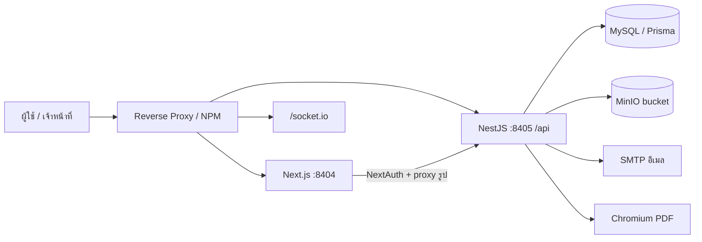
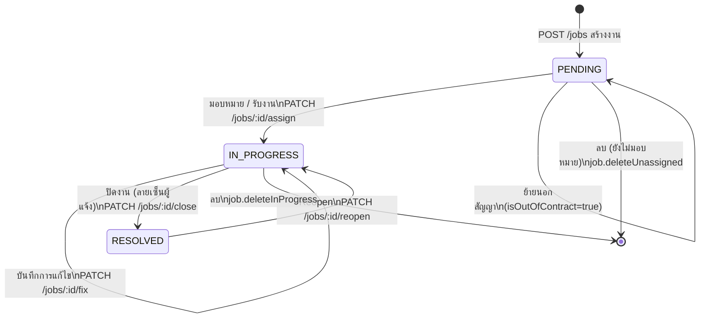
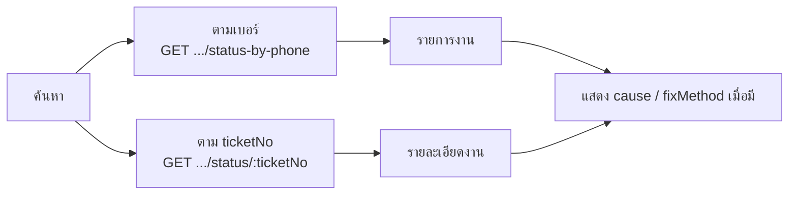
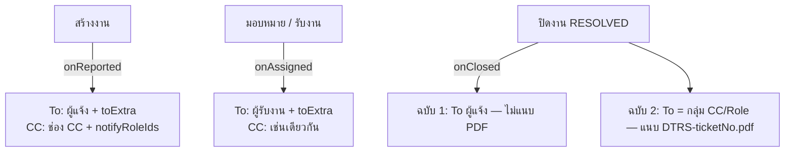
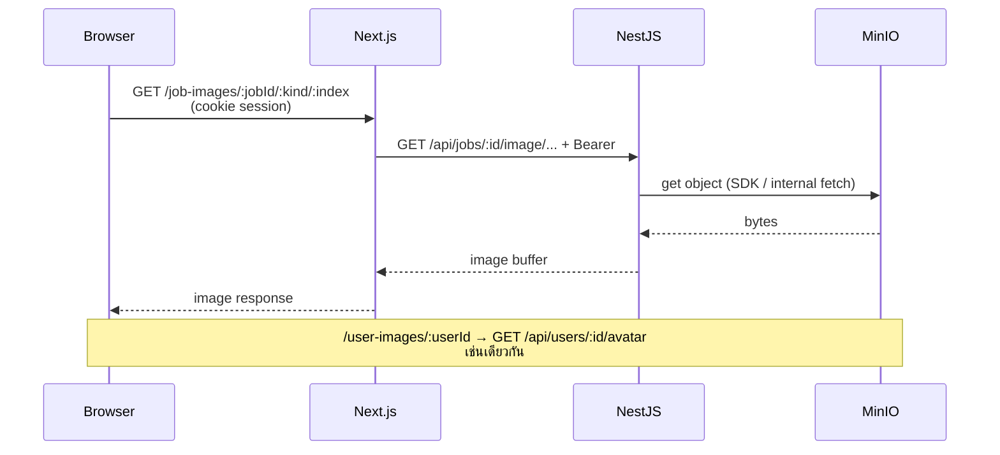
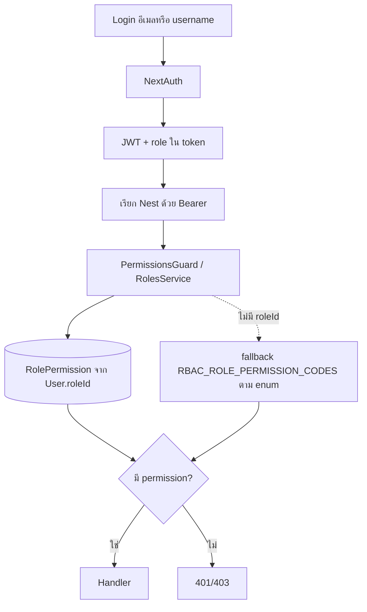
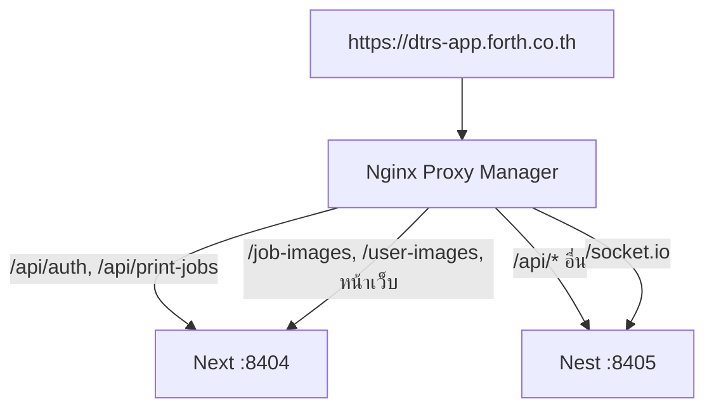

# System Workflow (dtrs-app)

แผนภาพและลำดับงานหลักของระบบแจ้งซ่อม CCTV — ใช้เป็นจุดรวมอ้างอิงสำหรับทีมและ AI Agent

**อัปเดต:** 2026-08-17  
**Production:** `https://dtrs-app.forth.co.th`

เอกสารนี้ **สรุป flow** ไม่แทนที่รายละเอียด API/RBAC/env — ดูลิงก์ท้ายเอกสารเมื่อต้องลงลึก

---

## 1. ภาพรวมสถาปัตยกรรม



| ชั้น | หน้าที่ |
|------|---------|
| **Frontend** | Next.js 15 — หน้า public / dashboard / print; NextAuth; proxy `/job-images`, `/user-images` |
| **Backend** | NestJS — REST `/api/*`, JWT+RBAC, Socket.IO, อัปโหลด MinIO, ส่งอีเมล, สร้าง PDF |
| **Data** | MySQL (`Job`, `User`, `Site`, `Setting`, RBAC ฯลฯ) + MinIO (รูปงาน/โปรไฟล์) |

รายละเอียด path proxy: [`../backend/docs/Reverse-Proxy-Nginx-Proxy-Manager.md`](../backend/docs/Reverse-Proxy-Nginx-Proxy-Manager.md)

---

## 2. Lifecycle งานซ่อม (หลัก)

สถานะหลัก: **`PENDING` → `IN_PROGRESS` → `RESOLVED`** (+ **Reopen** กลับ `IN_PROGRESS`)

ธงเสริม: **`isOutOfContract`** (นอกสัญญา) — คงสถานะ `PENDING` ได้โดยไม่เปลี่ยนสถานะ



### กติกาสำคัญ

| การกระทำ | API | สิทธิ์หลัก | ผลต่อสถานะ |
|----------|-----|------------|------------|
| สร้างงาน | `POST /jobs` | public / JWT (เจ้าหน้าที่) | → `PENDING` + `ticketNo` hex 8 ตัว |
| มอบหมายให้ผู้อื่น | `PATCH /jobs/:id/assign` | `job.assign` | `PENDING` → `IN_PROGRESS`; บันทึก `assignedById`; **ไม่** ออก Running Doc No |
| รับงานเอง | `PATCH /jobs/:id/assign` (ตัวเอง) | `menu.pending` (หรือมี `job.assign`) | เช่นเดียวกับมอบหมาย |
| ย้ายนอกสัญญา | `PATCH /jobs/:id/out-of-contract` | `job.assign` | คง `PENDING`, ตั้ง `isOutOfContract`; **ไม่** ออกเลข |
| จำแนกเอกสาร | `PATCH /jobs/:id/classify-doc` | `job.classifyDoc` | เฉพาะ `RESOLVED` ที่ยังเป็น hex; แทนที่ `ticketNo` ด้วย `CM-SHF-2002-XXXX` หรือ `YYYYMM####` ครั้งเดียว; UI: `/dashboard/all` + `/dashboard/jobs/:id` |
| อัปโหลดรูปปัญหาที่แจ้ง | `PATCH /jobs/:id/issue-images` | `job.issue.upload` | งาน `PENDING` / `IN_PROGRESS` (รวมยังไม่มีผู้รับ); เติมได้ถึง 3 รูป ไม่ลบ/ไม่แทนที่; **5MB/ไฟล์** JPG/PNG/WebP/HEIC→JPEG; ไม่ใช้ `job.fix.*`; UI: job detail + wrench modal; fallback บีบรูปเมื่อ NPM 413 |
| บันทึกการแก้ไข | `PATCH /jobs/:id/fix` | `job.fix.self` / `job.fix.any` | คง `IN_PROGRESS` |
| ปิดงาน | `PATCH /jobs/:id/close` | `job.fix.self` / `job.fix.any` | → `RESOLVED` + `fixDate` + ลายเซ็นผู้แจ้ง |
| Reopen | `PATCH /jobs/:id/reopen` | `job.reopen.self` / `job.reopen.any` | → `IN_PROGRESS`, ล้าง `fixDate` |
| เปลี่ยนสถานะโดยตรง | `PATCH /jobs/:id/status` | `job.updateStatus` | ตาม payload |
| มอบหมายหลายงาน | `POST /jobs/bulk-assign` | เดียวกับ assign | สูงสุด 50 รายการ |

หมายเหตุข้อมูล import: งาน `IN_PROGRESS` / `RESOLVED` ที่ยังไม่มี `assignedToId` สามารถตั้งผู้รับงานได้โดย **คงสถานะเดิม** (กรณี `RESOLVED` จะล้าง `fixDate`)

รายละเอียด RBAC: [`../backend/docs/RBAC-Setup.md`](../backend/docs/RBAC-Setup.md) · API: [`../STATUS.md`](../STATUS.md)

---

## 3. Flow แจ้งซ่อม (Report)

หน้า: **`/public/report`** (เส้นทางเดิม `/report` redirect ได้)

```mermaid
flowchart TD
  Start[เปิด /public/report] --> Auth{มี session\nSTAFF/ADMIN/SUPERVISOR?}

  Auth -->|ไม่| Pub[ผู้ใช้ทั่วไป]
  Pub --> Phone[กรอกเบอร์ 10 หลัก + ตรวจสอบ]
  Phone --> Found{พบผู้แจ้งในระบบ?}
  Found -->|ไม่| Block[ยังเลือกสถานที่/ส่งไม่ได้]
  Found -->|ใช่| Site[เลือกจังหวัด → อำเภอ → สถานที่]
  Site --> Detail[รายละเอียด + รูปข้อขัดข้อง]
  Detail --> Post1[POST /jobs]
  Post1 --> Toast1[Toast + ticketNo hex]
  Toast1 --> Status[/public/status?phone=... หรือ ticketNo]

  Auth -->|ใช่| Staff[Flow เจ้าหน้าที่]
  Staff --> SitesNow[โหลด GET /sites ทันที]
  SitesNow --> PhoneOpt[เบอร์ 10 หลัก — ไม่บังคับพบในระบบ]
  PhoneOpt --> Detail2[รายละเอียด + รูป]
  Detail2 --> Post2["POST /jobs + Bearer"]
  Post2 --> Dash[/dashboard/jobs]
```

- รูปข้อขัดข้องอัปโหลด MinIO → เก็บใน `Job.images` (**สูงสุด 3 รูป · 5MB/ไฟล์ · JPG/PNG/WebP/HEIC→JPEG** — ตรวจทั้ง UI และ API)
- ถ้า reverse proxy ยัง default ~1MB: frontend บีบรูปแล้ว retry หลัง **413** — [`../backend/docs/Reverse-Proxy-Nginx-Proxy-Manager.md`](../backend/docs/Reverse-Proxy-Nginx-Proxy-Manager.md)
- Public lookup ผู้แจ้ง: ไม่ส่ง URL รูป MinIO (`image: null`)

---

## 4. Flow ตรวจสอบสถานะ (Public)

หน้า: **`/public/status`**



โหมดสาธารณะมาสก์ข้อมูลส่วนตัว/รูปตามที่ API ส่ง; เจ้าหน้าที่ที่ล็อกอินอาจเห็นรูปผ่าน proxy ตามสิทธิ์

---

## 5. Dashboard — หน้าจอตามคิวงาน

```mermaid
flowchart TD
  Login[/login → NextAuth → JWT] --> Dash[/dashboard]
  Dash --> Pend[/dashboard/pending\nPENDING ในสัญญา]
  Dash --> OOC[/dashboard/out-of-contract\nPENDING OOC +\nRESOLVED OOC จำแนกแล้ว]
  Dash --> Prog[/dashboard/in-progress\nIN_PROGRESS]
  Dash --> My[/dashboard/my-jobs\nงานที่รับผิดชอบ]
  Dash --> All[/dashboard/all\nทั้งหมด + bulk-assign +\nจำแนกเอกสาร]
  Pend --> Job[/dashboard/jobs/:id]
  OOC --> Job
  Prog --> Job
  My --> Job
  All --> Job
  Job --> Print[/print/jobs/:id\nเมื่อ RESOLVED]
  Job --> Classify[PATCH .../classify-doc\nRESOLVED + hex]
  Job --> IssueImg[PATCH .../issue-images\nPENDING หรือ IN_PROGRESS]
  Job --> Fix[PATCH .../fix\nคง IN_PROGRESS]
  Job --> Close[PATCH .../close\nลายเซ็นผู้แจ้ง → RESOLVED]
  Job --> Reopen[PATCH .../reopen]
```

| หน้า | โฟกัส |
|------|--------|
| `/dashboard` | สถิติ / กราฟ / เมนูด่วนตาม RBAC |
| `/dashboard/pending` | มอบหมาย · รับงาน · ลบไม่มอบหมาย · ยกเลิก — **ไม่มี** ปุ่มย้ายนอกสัญญา (ย้าย OOC หลังปิดงานผ่านจำแนกเอกสาร) |
| `/dashboard/in-progress` | อัปเดตแก้ไข · อัปโหลดรูปปัญหา (`job.issue.upload`) ใน wrench · ลบ IN_PROGRESS (ถ้ามีสิทธิ์) · แท็บสัญญา/นอกสัญญา (`job.viewContractTabs`) · ป้าย「รอเซ็นผู้แจ้ง」เมื่อแก้ครบแล้วยัง `IN_PROGRESS` |
| `/dashboard/my-jobs` | งานที่รับผิดชอบ · แท็บสัญญา/นอกสัญญา · ป้าย「รอเซ็นผู้แจ้ง」เมื่อแก้ครบแล้วยัง `IN_PROGRESS` · ไปหน้ารายละเอียดเพื่อปิดงาน |
| `/dashboard/jobs/:id` | รายละเอียดเต็ม · ไทม์ไลน์ · บันทึกการแก้ไข (`PATCH /fix`) · ปิดงาน + ลายเซ็นผู้แจ้ง (`PATCH /close`) · อัปโหลดรูปปัญหา (`job.issue.upload`, `PENDING`/`IN_PROGRESS`) · Backfill วันที่ · พิมพ์ · จำแนกเอกสาร (`RESOLVED` ที่ยังเป็น hex) |
| `/dashboard/all` | ประวัติทั้งหมด · bulk-assign · **จำแนกเอกสาร** (`job.classifyDoc`) · ซ่อน RESOLVED OOC ที่จำแนกแล้ว |
| `/dashboard/out-of-contract` | PENDING นอกสัญญา + RESOLVED นอกสัญญาที่จำแนกแล้ว (`menu.outOfContract`) |
| `/dashboard/settings` | SMTP · เทมเพลตอีเมล · รหัสผ่านเริ่มต้น · MinIO orphan · `app_meta` |
| `/dashboard/roles` · `/dashboard/users` · `/dashboard/sites` | จัดการตาม `menu.*` |

แท็บ **สัญญา / นอกสัญญา** (`SegmentedTabs`) บน `my-jobs` / `all` / `in-progress` แสดงเมื่อมี **`job.viewContractTabs`** — แยกด้วย `Job.isOutOfContract` + badge งานค้าง (ไม่นับ `RESOLVED`); ไม่มีสิทธิ์ = ไม่มีแท็บ และเห็นแค่งานในสัญญา

---

## 6. Flow อีเมลแจ้งงาน

เงื่อนไขรวม: SMTP ครบ + เทมเพลต `enabled` · ลิงก์ใช้ `publicBaseUrl` หรือ `FRONTEND_BASE_URL`



เอกสารเต็ม: [`Email-Notifications.md`](./Email-Notifications.md)

---

## 7. Flow รูปภาพ (MinIO private)

Bucket **ไม่**เปิด public read เป็นค่าเริ่มต้น — เบราว์เซอร์ไม่โหลด object URL ตรง



- พิมพ์/PDF ใช้ path `/job-images/...` บน Next (ไม่อยู่ใต้ `/api`) เพื่อให้ `` ส่ง cookie ได้
- ถ้า Nest โหลดจากโดเมน public ไม่ได้ ตั้ง `MINIO_SERVER_FETCH_BASE_URL` (LAN)

รายละเอียด: [`Project-Plan-Private-MinIO-Images.md`](./Project-Plan-Private-MinIO-Images.md) · [`minio.md`](./minio.md)

---

## 8. AuthN / AuthZ (ย่อ)



Sidebar เรียก `GET /roles/me/permissions` แล้ว `unwrapApiData` — ถ้าไม่มีเมนูที่รู้จักเลยจะ fallback ตามบทบาท

---

## 9. พิมพ์รายงาน / PDF

```mermaid
flowchart LR
  UI[ปุ่มพิมพ์บนงาน RESOLVED] --> Page[/print/jobs/:id\nlight theme]
  Page --> Data[GET /api/print-jobs/:id/data → Next]
  Page --> Img[/job-images/... → Nest]
  UI --> PDF[GET /api/jobs/:id/report-pdf]
  PDF --> Pup[Nest + Chromium เปิดหน้า print]
  Pup --> File[ดาวน์โหลด PDF]
```

เทมเพลต: `JobMaintenancePdfTemplate` + `PdfReportHeader` + `print.css` (รายงาน CM/SHF 2 หน้า)

---

## 10. Request path บน Production (โดเมนเดียว)



อย่า strip `/api` ก่อนส่ง Nest — global prefix คือ `api`

---

## 11. CI / Deploy (อ้างอิง)

Flow เต็มอยู่ที่ [`GitLab-CI-Plan.md`](./GitLab-CI-Plan.md)

สรุปสั้น:

- Branch **`staging`** → build/test → manual Docker UAT บน `.115`
- Branch **`main`/`master`** → build → docker build บน `.115` → transfer → manual deploy PRD `.128`
- Containers: `dtrs-app-frontend` / `dtrs-app-backend`, network `dtrs-app-net`, ports **8404/8405**

---

## 12. แผนที่เอกสารที่เกี่ยวข้อง

| หัวข้อ | เอกสาร |
|--------|--------|
| ดัชนี `docs/` | [`README.md`](./README.md) |
| หน้าจอ + tech stack | [`../README.md`](../README.md) |
| สถานะระบบ + ตาราง API | [`../STATUS.md`](../STATUS.md) |
| RBAC | [`../backend/docs/RBAC-Setup.md`](../backend/docs/RBAC-Setup.md) |
| อีเมล | [`Email-Notifications.md`](./Email-Notifications.md) |
| MinIO private | [`Project-Plan-Private-MinIO-Images.md`](./Project-Plan-Private-MinIO-Images.md) |
| Serial หลายแถว | [`Job-Serial-Multi-Row.md`](./Job-Serial-Multi-Row.md) |
| Reverse proxy | [`../backend/docs/Reverse-Proxy-Nginx-Proxy-Manager.md`](../backend/docs/Reverse-Proxy-Nginx-Proxy-Manager.md) |
| GitLab CI | [`GitLab-CI-Plan.md`](./GitLab-CI-Plan.md) |
| Agent DoD | [`../AGENTS.md`](../AGENTS.md) |

เมื่อพฤติกรรมงาน/สิทธิ์เปลี่ยน — อัปเดตเอกสารต้นทาง (`STATUS` / `RBAC-Setup` / `Email-Notifications`) แล้วปรับแผนภาพในไฟล์นี้ให้สอดคล้อง
